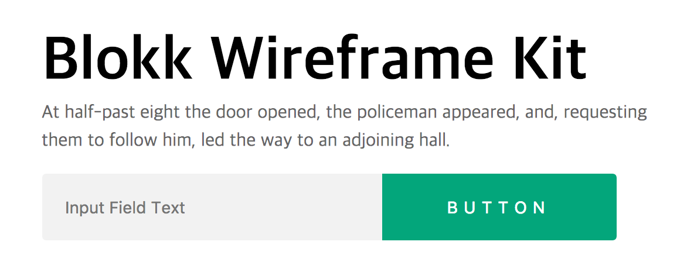

## 1. Responsive web design 과제하다가 메모
#### 1-1. img태그가 text-align으로 중앙정렬이 가능하네 (마치 img태그가 글자인 것처럼)
- text-align은 block 요소 안에 있는 **inline 요소**를 정렬합니다.
- inline 과 block 요소 차이는 다음을 참고
  - inline 요소 :줄 속에 끼워 넣는 요소로
  - 예 : ```<span>, <b>, <a>, ```태그 등
- block 요소 : 해당 요소가 속한 줄은 가로 화면 전체100%를 차지하며 앞뒤로 줄 바꿈이 됨
  - 예 : ```<p>,  <div>, <ol>, <ul>, <table>``` 등

#### 1-2. 햄버거 메뉴생성방법중 하나
```
.navicon-bar::before,
.navicon-bar::after
```

#### 1-3. [css] :before , :after 가상 요소
오늘은 가상 요소 :before 와 :after 선택자 입니다.
두 선택자는 요소에 **내용을 생성하는 역할**을 하는데
html 문서에 쓰지 않고도, css로 내용을 삽입할 수 있습니다.
(주로 content 속성과 함께 사용)

##### 가상 선택자가 쓰이는 경우
아래의 경우에 가상 선택자가 사용됩니다.
- 텍스트끼리 서로 구분할 경우
- 특수코드를 변환없이 그대로 보여줄 경우
- 백그라운드 이미지를 해당 문구 앞 또는 뒤에 삽입하는 경우

<hr>

## 2. 실습 (0726)
  ### 2-1. 디자인에 대하여
모든 사용자가 편하게 사용 가능해야 아름다운 디자인이라고 말할 수 있다. 
- 키보드 이벤트가 안이쁘다고 해서 지우면 안된다.(:focus)
  - 데스크탑 사용자 중에 키보드로만 작업하는 유저가 존재한다.
- (생산성)버튼 주변에 패딩으로 적용해야지 반응형시 조정이 쉽다.
- (확장성)간격배치시 margin으로 작업하면 디바이스별로 구조가 무너질 수 있다.

### 2-2. mitto's Hell day실습 위주
**실습하기 전 오늘의 point**
- 마진겹침 현상 
  - 마진이 겹칠 경우 패딩으로 해결한다.
- main 섹션에 있는 input과 버튼


  1. text input과 button input붙이기
  2. text input의 placeholder 왼쪽에서 떨어트리기.
      - 나 : text input과 button input 둘다에 ```float:left```를 주었다.
      - mitoo조교님의 방법들 
        - input 간격 줄이는 방법
            1. 방법1) input 과 버튼에 float 을 주고 부모요소에 플롯해제
            2. 방법2) input 과 버튼 부모요소에 font-size: 0; 을 주고
                  input 과 버튼에 font-size 제 선언
            3. 방법3) 부모요소에 display: flex
- 의미가 있는 부분에는 태그를 달리해서 구분하는 연습.
- 주석 남기는 습관.

#### 2-2-1. h1의 사용
- 브라우저는 h1이 대표이름이라고 인지한다.
- h1은 한 페이지에 하나만 쓰는걸 추천한다. (가장 중요한 요소에 like LOGO)
- h1~h6에 대한 규칙을 정하고 시작해야한다.
  - 속성에 대한 것보다 의미적인것 + 와이어프레임을 보면서 h태그를 써야할 부분을 설정하는 것

#### 2-2-2. 시멘틱 태그의 사용
- 해당 콘텐츠마다 의미있는 태그를 사용할 수 있도록 훈련해야한다.
- **LIKE** section과 article의 차이

#### 2-2-3. ul과 ol
- 순서가 있는 태그와 없는 태그를 때에 맞춰서 써야한다. (남용하면 안되다.)
- 레이아웃에서 같이 묶여있는 부분에서는 li태그를 사용하여 정렬한다.

#### 2-2-4. 네이밍
- 네이밍은 자바스크립트까지 사용하기 때문에 신중하게 네이밍하고 사용하자. (훈련이 어느정도 되면 코딩컨벤션도 작성해보자)
  - 네이밍스타일은 개발자마다 다르다.
  - mitto쌤 네이밍 스타일 
    - header의 자식 요소들은 앞에 header를 붙이면서 작업한다.
    - headerLogo, headerMenu .. (카멜케이스)
    - 앞에 숫자나 띄어쓰기를 하면 안된다.
- 네이밍, 즉 코딩컨벤션은 실제 작업 전 모든 이해관계자와 협의 후 정의해야한다. 그리고 개발시작.
- ex. [네이버 코딩컨벤션]('http://nuli.navercorp.com/sharing/fe/coding')

#### 2-2-5. id를 사용하냐, class를 사용하냐
- id는 충돌의 원인이 된다.
- 웬만하면 쓰지 않는걸 추천한다.

#### 2-2-6. 시안을 받으면 꼭 손코딩해서 구조도 작성 후 작업시작하자. (훈련이 된다면 패스해도 되지만..우선 필수)
- 손코딩은 기록이 남는 장점이 있기 때문에 내가 잡은 구조가 틀릴 경우 스스로 피드백을 하며 공부할 수 있다.
- 때문에 기억에 오래 남는다.
- 코드는 짧을 수록 좋다. (성능기준)
- 오늘은 html/css를 구조도 짜보자.


> mitoo 조교님의 자료

#### 2-2-7. 공부하다가 삽질한 코드가 있을 경우
- 일련의 과정들도 주석처리해서 깃헙에 올리자.
- 그 과정들에서 왜 오류가 났는지도 적어서 올리면 오래 기억이 남는다. 
- 마치 오답노트를 적듯이.

#### 2-2-8. 제목이 없는 디자인이더라도 h2~h5를 작성해야한다. 
- 섹션마다 제목을 작성을 필수로 해야한다. (다양한 유저들이 있기 때문에)
- 때문에 디자인적으로 한 섹션에 제목이 없더라도 작성 후에 숨겨서 보이지 않게 한다.
- 브라우저가 렌더할 수 있도록 셋팅하는 과정이다.

#### 2-2-9. 탭키를 누르면서 이동하는 유저
- 상황) 탭키를 누르면서 이동할 경우 메뉴가 아주 많은 경우에는 본문으로 이동하기가 힘들다. 
- 이럴 경우 윗쪽에 본문으로 가기 버튼을 놓으면 접근성면에서 좋다.
- 탭키를 각 요소마다 보여지는 ```:focus``` 디자인은 지우지말고 표시해두자. (for 유저)


#### 2-2-10. height값은 웬만하면 적용하지 말자.
- 자식요소에 height값을 적용하여서 높이값을 조정하자!!
- height값을 지정할 경우 확작성이 떨어진다.
- 오늘 실습중에 실수로 height값을 주었더니, 아랫부분에 float가 많이 꼬였었다.
