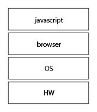

### 오늘배운내용  # Day9_0728_금요일
<hr>

출처 >
[poiemaweb](http://poiemaweb.com/)

에버노트 정리 >
[Nayoung's Evernote_072]()
<hr>

목차
1. 코딩과 프로그래밍
2. 자바스크립트란 무엇인가!
3. 안녕? 자바스크립트!

# javascript 시작
## 0. 메모
- 모듈이란?
- eslint 설치 프로세스
- 주석을 꼭 쓰자.
  - 이 코드를 왜 만드는지
  - 이 인자는 무엇인지 > 무엇을 만드는 것인지 등등

## 1. 프로그래밍

> Computational Thinking (코딩과 프로그래밍의 차이)

- 컴파일러
  - 통역자
  - 자바스크립트 = 인터프리터 언어
    - 동시통역 => 컴파일러가 필요 없다.
> 컴파일러와 인터프리터


- 코딩은 문제 해결의 최종 결과물을 작성하는 **도구**이지 <u>결코 코딩이 문제를 해결하지는 않는다.</u>
- 해결 과제를 명확히 이해한 이후 그 문제의 해결 방안을 고려할 때 컴퓨터의 관점에서 문제를 바라보아야 한다. 이때 필요한 것이 ```Computational thinking```이다.
  - 디자인쪽에는 사회문제를 디자인적으로 해결한다는 디자인띵킹방법들이 있는데 프로그래밍쪽에는 컴퓨테이션 띵킹이라는 다른 접근방법이 있구나.
```
프리스쿨때 강사님께서 로또번호 추출하는 방법이나 랜덤칼라 함수를 짜는방식등 보여주는 방식은 수학문제를 풀듯이 짜는 걸 보았는데,
수학적 사고로 접근한 방식이라는 걸 알게됨..!
```

- 프로그래밍은 요구사항의 집합을 분석하여 적절한 자료구조와 함수의 집합으로 변환한 후 그 흐름을 제어하는 것이다.

## 2. 자바스크립트란?
- Javascript는 HTML, CSS와 함께 웹을 구성하는 요소중 하나로 <u>**웹브라우저**에서 동작하는 유일한 언어이다.</u>
- 자바스크립트로 html에 접근가능하다.
- c언어 기반의 언어
- 프로토타입 기반의 객체지향 언어
- Node.js는 프론트엔드와 백엔드까지 아우를 수 있는 플랫폼이다.
- 모바일 하이브리드 : PhoneGap, Sencha Touch, Ionic
- 서버사이드 : NodeJS

  - 서버사이드란 
  ```
  서버 사이드(server-side)란 서버 측에서 수행하는 처리를 의미합니다. 
  브라우저에서 요청한 HTML 문서에 서버 사이드 스크립트 언어의 코드가 포함되어 있으면, 
  서버는 이 부분을 자신이 처리하고 그 결과를 브라우저에 보내 줍니다. php, nodejs ...
  ```
  - ps. 클라이언트 사이드
  ```
  클라이언트 사이드(client-side)란 클라이언트 측에서 수행하는 처리를 의미합니다.
  웹 시스템에서 브라우저는 서버에서 수신한 HTML 문서를 해석하여 여러분의 화면에 표시해 줍니다.
  이러한 클라이언트 사이드에서 자주 사용하는 스크립트 언어에는 자바스크립트(JavaScript)가 있습니다.
  ```
  

- desktop : Electron, AppJS
  - AppJS : Node.js로 데스크탑 앱을 만드는 app.js
- 로봇제어 : Cylon.js, NodeBots
- Node.js : 동작환경 (env)


> 문법과 의미 (Syntax & Semantics)
- HTML/CSS
  - 선언형 : 가져다가 나열하는 방석
- Javascript
  - 하나하나 다 명령을 내려야함.
  - 프로그래밍이나 알고리즘을 짜는 방식을 연습하자.
  - 크로스 브라우징이 가능하다.
  - jquery 는 얕게 배울 예정이다.
    - 따로 배울 예정이면 따라서 해보면 알 수 있다.
  - 자바스크립트는 C언어 기반의 언어이다.
  - 서버에서도, 브라우저에서도 등등 범용적으로 사용할 수 있다.


## 2. 브라우저 동작원리
- 대부분의 언어는(루비,파이썬,C..) 운영체제 위에서 **실행**된다.
- 자바스크립트는 html,css와 함께 브라우저에서 **실행**된다.
  - 때문에 브라우저 환경을 고려해야 더 효율적인 프로그래밍 가능.



- initial Request의 url을 보내면 기본적으로 뒤에 index.html이 있다고 보면된다. 그래서 index.html이 불려와지는 것.
- 트리구조에 데이터를 만들어서 메모리에 올린다.
- 파일은 읽어야지 인지할 수 있다. 
- dom은 트리구조로 되어있어서 DOM Tree라고도 한다.
- dom api가 있어서 html의 코드를 지우기도하고 바꾸기도 하고 할 수 있는 것이다.
- display한다 = painting한다고 한다.
- 스크립트 태그를 만나면 자바스크립트가 실행된다.
- DOM 트리를 다 만들고 DOM을 건드려야한다.
  - 그래서 위치가 body 마지막에 자바스크립트 script태그를 넣는것.
- css는 위쪽에 있는 이유는 먼저 파싱해야 페이지가 로딩될때 자연스럽다.
- 결국 자바스크립트가 하는 일은 html, 즉 DOM을 건드리는 일이다.

> jquery를 쓰는 이유
- 브라우저 종류마다 api가 적용이 안되는 브라우저가 있는데, 이때 jquery가 해결해준다.

- 보통 통상적으로는 javascript라고 불리지만, 정확히는 ```ECMAscript 몇버전.``` 이라고 한다.

## 3. 안녕, 자바스크립트.

- 스크립트를 만나면 자바스크립트를 파싱 후에 html을 파싱하기 때문에 body마지막에 추가하는 것이다. 
- 하지만 아래처럼 스크립트를 인지하여도 무시하고 끝까지 파싱하는 경우가 있다.

> 아래 링크 꼭 읽기


- async : 비동기 = 병렬로 움직인다는 뜻. 스크립트는 다운로드 완료 직후 실행.
- defre : script태그를 만나도 만나지 않고 쭉 읽는다. 스크립트를 만났다는 것을 자바스크립트엔진에 던지고 쭉 가는 것이다. html 파싱이 끝났을 때 script를 실행한다.

## 4. Javascript Syntax Basics
> 구문과 함수
- if<u>문</u>, else<u>문</u>
- 무조건 세미콜론으로 닫혀야한다.
- 세미콜론
  - 세미콜론을 넣는 플랫폼이 있고 아닌 것도 있다.  
  - 구문이 종료되는 의미.

## 5. 자바스크립트 데이터 타입과 변수
- Symbol
- ES6에서 새롭게 추가된 7번째 타입이다.
- 변경불가능한 자료형이다.
- 심볼(Symbol)은 프로그램이 이름 충돌의 위험 없이 속성(property)의 키(key)로 쓰기 위해 생성하고 사용할 수 있는 값입니다.
- 프러퍼티 키로 사용한다.
- [심볼이 나온 이유](http://hacks.mozilla.or.kr/2015/09/es6-in-depth-symbols/)
  


## 0. 수업 중 궁금한 점
> 모듈이란?
- [생활코딩](https://opentutorials.org/module/532/4750)
- 모듈이라는 형태로 떼어내서 또다른 프로그램에 사용한다.
- 자주 사용하는 코드를 별도의 파일로 만들어서 필요할 때마다 재활용하는 것.

### eslint 설치 프로세스
--------
#### 1. eslint 초기화하기 
1. 글로벌 영역에 설치한다. (= 특정 디렉토리가 아닌 컴퓨터 자체에 설치하는 의미) 
```
npm install -g eslint
```
(여기서 -g는 global의 약자)

2. json파일을 생성하기 위해서 프로젝트 폴더로 이동한다.
```
cd <project-folder>
```

3. 해당 디렉토리에서 npm을 초기화한다.
```
npm init -y
``` 
(여기서 -y는 yes라는 의미인데, -y없이 실행하면 질문이 나오므로, 한꺼번에 처리하는 명령어)

4. eslint를 초기화한다.
```
eslint --init
```

5. 어떤 코딩스타일을 설치할것인지 질문이 나온다.
    1. 어떤방식으로 eslint를 환경설정할것인가요? 
       - 유명한 스타일 가이드를 사용해서
    2. 어떤 스타일가이드를 원하는지?
       - Aribnb
       - Google은 너무 콤팩트하다고함.
    3. 리엑트에 사용할건가유?
    4. 환경 파일에 어떤 포맷으로 설정하고 싶은가요 ~ : 

``` Installing eslint, eslint-plugin-import, eslint-config-airbnb-base```
- eslint, import, airbnb-base 플러그인들 설치한다고함.


#### 2. VSCode 셋팅
- VSCode 자체에 셋팅되어있는 자바스크립트 검사기를 꺼놓는다.

#### 3. eslintrc.js
- 해당 디렉토리에 가면 eslintrc.js파일이 생성된걸 볼 수 있다. 
  - eslint 뒤에 붙은 rc란?
  - rc파일은 사용, 형식화 및 전반적인 의미를 다를 수있는 구성 파일입니다.
  ```
  [Unix: from runcom files on the CTSS system 1962-63, via the startup script /etc/rc] Script file containing 
  startup instructions for an application program (or an entire operating system), usually a text file containing 
  commands of the sort that might have been invoked manually once the system was running but are to be executed 
  automatically each time the system starts up. Thus, it would seem that the "rc" part stands for "runcom", which I believe can be 
  expanded to "run commands". In fact, this is exactly what the file contains, commands that bash should run.
  ```
- eslintrc.js파일에 가면 초반에 
```"extends": "airbnb-base"```가 있을 것인데,이를 다른 코드로 바꾼다.
- 이 파일에 eslint에서 검사기준이 되는 규칙들을 rules에 넣고, plugin을 추가로 설치한다면, 해당 플러그인을 추가로 적어야한다.
- 코드에서 env는 환경을 이야기하며, 여기서는 브라우저, commonjs, es6, node, jquery의 문법을 on시켜놓은 것이다..
  - es6에서는 var가 사라졌기때문에 var를 사용시 오류체크가 날 것이다.. 이를 해제하려면 no-var를 0으로 만들어서 규칙에서 off시키면 된다.

#### 4. eslint-plugin-html (옵션)
- html 스크립트 태그 내의 자바스크립트에도 eslint를 적용하고 싶은 경우 설치한다.
```
$ npm install --save-dev eslint-plugin-html
```
  - 여기서 --save와 --save-dev의 차이점은?

  >[출처1](http://ohyecloudy.com/ddiary/2016/09/04/til-npm-install-save-or-save-dev/)
 
  - --save나 --save-dev없이 설치하면 디렉터리 패키지에 설치하고 종료됨
  - --save나 --save-dev는 package.json 업데이트도 같이 해준다.
    - 어디에 패키지 정보를 추가하냐에 따라 다른 명령어인 것이다.
     - --save 옵션은 dependencies object에 추가하고 --save-dev 옵션은 devDepenencies object에 추가한다.
     - [여기 코드](https://gist.github.com/bynaki/96032332bd38c41a892d)를 확인해보자.

#### 5. VSCode Setting
- eslint가 문법검사를 허용하도록 에디터에 명령해야한다.
```
"eslint.validate": [
    "javascript",
    "javascriptreact",
    "html"
]
```