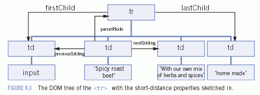

# 1. Node의 계층구조
## 1.1  Node 타입

- Node.ELEMENT_NODE(1)
- Node.ATTRIBUTE_NODE(2)
- Node.TEXT+NODE(3)
- Node.CDATA_SECTION_NODE(4)
- Node.ENTITY_REFERENCE_NODE(5)
- Node.ENTITY_NODE(6)
- Node.PROCESSING_INSTRUCTION_NODE(7)
- Node.COMMENT_NODE(8)
- Node.DOCUMENT_NODE(9)
- Node.DOCUMENT_TYPE_NODE(10)
- Node.DOCUMENT_FRAGMENT_NODE(11)
- Node.NOTATION_NODE(12)

```js
// Node.nodeType 프로퍼티는 읽기전용 프로퍼티이다.
if (somdNode.nodeType == Node.ELEMENT_NODE){
  alert("Node is an element.");
}
// 브라우저 호환성을 위해 숫자형 값과 비교하면 좋다.
if (somdNode.nodeType == 1){
  alert("Node is an element.");
}
```

### 1.1.1 nodeName, nodeValue 프로퍼티
해당 노드 정보를 제공하는데, 노드 타입마다 프로퍼티값이 다르므로, 값을 사용하기전에는 항상 노드타입을 테스트해야한다.

### 1.1.2 노드 사이의 관계


#### 1.1.2.1 childeNodes
- childeNodes 프로퍼티 : NodeList가 저장된다.
- NodeList : 배열 비슷한 객체인데, 노드를 순서 있는 목록으로 저장하여 위치 기반으로 접근할 수 있다. 
  - 즉, `length`프로퍼티가 있다. `하지만 Array의 인스터스는 아니다.`
  - length프로퍼티는 `호출당시` NodeList에 담긴 노드 숫자이다.
  - NodeList는 DOM구조에 대한 쿼리 결과이며, 문서가 바뀌면 NodeList 객체에도 자동으로 반영된다.
  - 계속 바뀌는 성질때문에 `살아있는`객체라고 부르기도 한다.
  - NodeList에 저장된 노드를 접근하는 방법은
    1. 대괄호 표기법
    2. item() 메서드로 접근한다.
  - Array.prototype.slice()를 사용해 NodeList객체를 배열로 바꿀 수 있다.
  ```js
  // slice메서드는 2개의 매개변수를 받는데, 각 매개변수는 원래 배열에서 가져올 데이터 범위의 시작과 끝이다.
  var arrayOfNodes = Array.prototype.slice.call(someNode.childNodes,0);
  // 표준 빌트인 참조타입 중의 프로토타입을 가져와야하므로, call 메소드를 이용하여 가져왔다.
  ```
- childeNodes는 꼭 필요하다기 보다는 편의를 위해 추가된 것이다. 
- `hasChildNodes()`메서드 : 노드에 자식 노드가 있다면 true를 반환한다.
```js
var elem = document.querySelector('ul');
console.log(elem); // ul

if (elem.hasChildNodes()) {
  console.log(elem.childNodes);
  // [text, li#one.red, text, li#two.red, text, li#three.red, text, li#four, text] 모든 노드를 반환한다. 텍스트토드,엘리먼트노드, 등등.
  elem.childNodes[1].className = 'blue';
}
```

#### 1.1.2.2 기타 프로퍼티
- `parentNode` 
- `previousSibling` 
- `nextSibling`

#### 1.1.2.3 공통의 프로퍼티 
 - `ownerDocument` 프로퍼티
 : 전체 문서를 표현하는 문서 노드에 대한 포인터이다.

<hr>

### 1.1.3 노드 조작
- 노드 사이의 관계 포인터는 모두 읽기 전용이다.
- 노드를 조작하는 메서드는 따로 있다.
- 아래 메서드는 모두 특정 노드의 자식에서만 동작하므로 `parentNode`프로퍼티에 해당하는 부모 노드를 정확히 알야아 한다.

`apendChild()`
- childNodes 목록에 노드를 추가한다. (자식의 마지막에 추가된다.)
- 노드가 추가될 때는 추가한 노드, 부모 노드, 등 모든 관계 포인터가 업데이트 된다. > 업데이트 후에 appendChild()는 새로 추가한 노드를 반환한다.

`insertBefore()`
- 특정 위치로 옮겨야 할때 사용한다. 
- 매개변수로는 `삽입할 노드`와 `기준 노드` 두 가지를 매개변수로 받는다.
- 기준 노드의 이전 형제가 된다. 
- 삽입이 완료되면 삽입한 노드를 반환한다.

`replaceChild()`
- `기존 노드를 교체`한다.
- 매개변수로는 `삽입할 노드`와 `교체할 노드` 두개를 받아서 교체할 노드가 있는 자리에 삽입할 노드가 대신 들어간다. 
- 교체할 노드는 아직 같은 문서 소유이긴 하지만 문서에서 위치를 지정받지는 못한 채 붕 떠 있는 상태이다.

`removeChild()`
- 노드를 제거할 때 사용하는 메서드.
- 매개변수는 제거할 노드만 받는다.
- 제거된 노드 역시 아직 해당 문서소유이긴 하지만 문서에서 위치를 지정받지는 못했다. 

### 1.1.4 기타메서드
`cloneNode()`
- 자신을 호출한 노드의 복제본을 생성한다.
- 매개변수로는 Boolean 값을 받는데, 자손노드까지 복제할지 말지를 결정한다. (true : 자식까지 복제)

## 1.2 Document 타입
## 1.3 Element 타입
## 1.4 Text 타입
## 1.5 Comment 타입
## 1.6 CDATASection 타입
## 1.7 DocumentType 타입
## 1.8 DocumentFragment 타입
## 1.9 Attr 타입