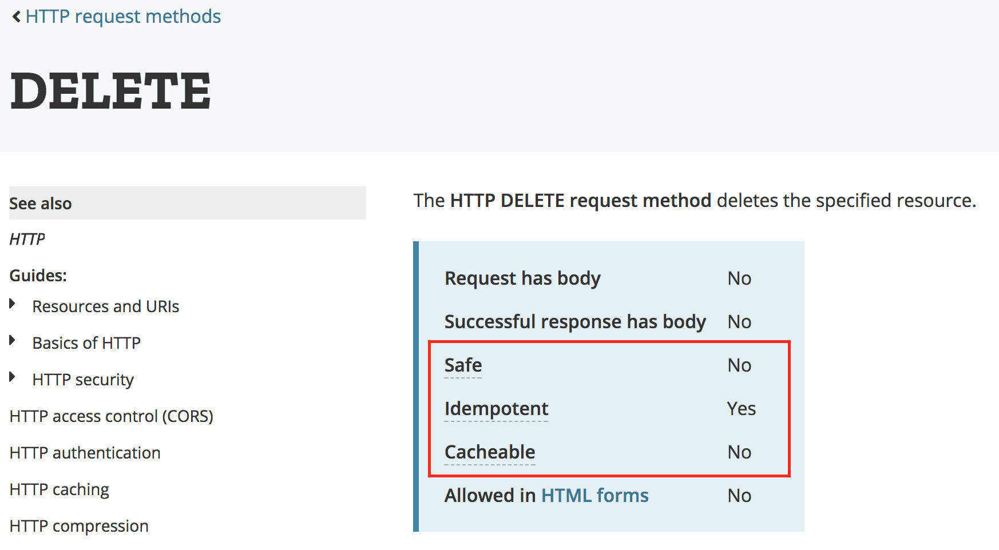
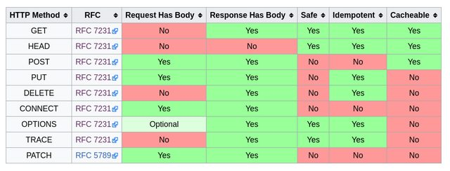
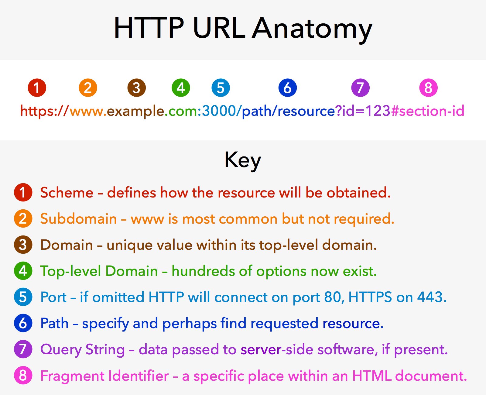
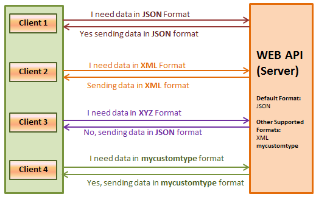

# nodeJS 2일차
1. HTTP 까보기
  - wireShark
  - Chrome Devtools
  - HTTP, HTTPS, HTTP/2
  - HTTP 구성요소
    - Request & Response
    - Requets
      - Request Methods
      - URL
      - Request Target
    - Response
      - Response Status
      - Status category
    - Header
2. Express
  - Routing
  - Request 객체
  - Response 객체
3. Template Language

## 서론
웹 서버는 일반적으로 웹 브라우저라고 하는 클라이언트에서 HTTP 프로토콜로 요청한 정보를 처리한 후 응답을 보내 주는 역할을 한다. 
- 웹서버를 만들어 실행하는 과정을 보면, createServer()메소드를 호출하여 웹 서버 객체를 만들고, 그 객체의 listen() 메소드를 호출하여 특정 포트에서 대기하도록 설정한다. 
- 서버객체에서 사용할 수 있는 대표적인 메소드
  - `listen(port,[hostname],[backlog],[callback])` : 서버를 실행하여 대기시킵니다.
  - `close([callback])` : 서버를 종료합니다.

## HTPP란
`웹 브라우저와 웹 서버 간의 통신을 위해 개발된 통신규약`
## HTTP와 HTTPS
HTTP
- 80번 포트

HTTPS
- 443번 포트
- HTTP 통신을 암호화해 주고받는 내용을 중간에서 가로챌 수 없도록 함

## HTTP/2
- 구글의 SPDY 프로토콜을 만들어서, 구글 서버와 크롬에 탑제를 함.
- 반드시 HTTPS를 사용해야함
- 빠름을 목적으로 제작됨.


# HTTP 구성요소
## Request와 Response
- 웹 -- 요청 --> 서버
- 웹 <-- 응답 -- 서버

## Request Methods
GET / HEAD / POST / PUT / DELETE / CONNECT / OPTIONS / PATCH <br>
[HTTP 명세의 8종류](https://developer.mozilla.org/ko/docs/Web/HTTP/Methods)
- html의 form에서도 post 속성을 넣어서 요청을 보낼 수 있다.

## 메소드의 성질
Safe
- 읽기 전용 요청
- `GET`
- 서버에 영향을 미치지 않아야 함

Idempotent
- 여러번 같은 요청을 해도 한 번 요청한 것과 같은 효과여야함.
- 네트워크가 불안정해도 안전하게 요청을 보낼 수 있음


- PUT과 PATCH의 차이
  - PUT은 전체를 수정하는 메소드
  - PATCH는 부분을 수정하는 메소드

Cacheable
- (특정 조건을 만족하면) 응답을 클라이언트에 저장해두었다가 다음 번 요청 때 다시 쓸 수 있음.


## URL


- Scheme
- Subdomain
- Domain
- Top
- Port
- Path
- Query String
- Fragment Identifier

## Percent Encoding
- URL은 아스키 문자 밖에 사용하지 못하기 때문에 none-아스키 문자를 위한 표현 방법이 필요함
- Percent encoding은 non-ASCII 문자를 위한 웹 표준 인코딩 방법으로, JavaScript에 관련 기능이 포함되어 있음

```js
> encodeURIComponent("한글")
"%ED%95%9C%EA%B8%80"
> decodeURIComponent("%ED%95%9C%EA%B8%80")
"한글"
```
## Request Target
일반적인 경우 아래와 같은 구조가 사용된다.
- 절대경로 + query String + fragment id
```
GET /path/to/resource?foo=bar&spam=hoge#fragid HTTP/1.1
```

## Response Status
응답의 성공, 실패 여부와 종류를 나타냄
- [HTTP Status Codes](https://httpstatuses.com/)

### Status Categroy
2XX
- 성공
- `200 OK` : 성공
- `201 Created` : 자료가 성공적으로 생성됨.

3XX
- 추가 작업이 필요함
- `301 Moved Permanently` : 자료가 완전히 다른 곳으로 이동했음.
- `302 Found` : 자료가 일시적으로 다른 곳에 있음
- `304 Not Modified`(Cache) : 클라이언트가 이미 가지고 있던 자료가 수정되지 않았음. (그대로 사용하면 됨)

4XX
- 실패 : 클라이언트가 잘못
- `400 Bad Request` : 요청의 형태가 잘못되어 응답할 수 없음
- `403 Forbidden` : 요청한 자료에 접근할 권한이 없음
- `404 Not Found` : 요청한 자료가 없음

5XX
- 실패 : 서버책임
- `500 Internal Server Error`
: 요청을 처리하던 중에 예상치 못한 오류가 발생함
- `503 Service Unavailable` : 서버가 일시적으로 응답을 할 수 없음

## Header
- 요청과 응답에 대한 추가 정보를 표현하는 데 사용됨
- **인증, 캐싱, 쿠키, 보안, 내용협상, 프록시** 등 `웹 표준에 정의된 많은 기능을 제어하는 데 사용됨.`
  - Authorization : 요청의 인증 정보
  - User-Agent : 요청 중인 클라이언트의 정보
  - `Location` : 301, 302 응답에서 자료의 위치
  - Accept : 요청이 어떤 형태의 자료를 원하는지 나타냄
  - Content-Type : 요청 혹은 응답이 어떤 형태의 자료인지 나타냄
  - Content Negotiation : 요청의 Accept, Accept-Language 등의 헤더를 보고 서버가 그에 맞는 형태의 자료를 응답하는 절차를 content negotiation(내용협상)이라고 함
  
- postman에서는 Header탭에서 볼 수 있다. 

<hr>

## Express
1. Routing
2. Request 객체
3. Response 객체
- Node.js 생태계에서 가장 널리 쓰이는 웹 프레임워크
- 내장하고 있는 기능은 매우 적으나, 미들웨어를 주입하는 방식으로 기능을 확장하는 생태계를 가지고 있음
- [공식한글메뉴얼](https://expressjs.com/ko/4x/api.html)

### 앱의 기본 구조
```js
// Express 인스턴스 생성
const app = express()

// 미들웨어 주입
app.use(sessionMiddleware())
app.use(authenticationMiddleware())

// 라우트 핸들러 등록
app.get('/', (request, response) => {
  response.send('Hello express!')
})

// 서버 구동
app.listen(3000, () => {
  console.log('Example app listening on port 3000!')
})
```

### Routing
```js
// HTTP 요청 메소드(GET, POST, ...)와 같은 이름의 메소드를 사용
app.get('/articles', (req, res) => {
  res.send('Hello Routing!')
})
// 특정 경로에만 미들웨어를 주입하는 것도 가능
app.post('/articles', bodyParserMiddleware(), (req, res) => {
  database.articles.create(req.body)
    .then(() => {
      res.send({ok: true})
    })
})
// 경로의 특정 부분을 함수의 인자처럼 입력받을 수 있음
app.get('/articles/:id', (req, res) => {
  database.articles.find(req.params.id) // `req.params`에 저장됨
    .then(article => {
      res.send(article)
    })
})
```

## Request 객체
### req.body
요청 바디를 적절한 형태의 자바스크립트 객체로 변환하여 이곳에 저장 (body-parser 미들웨어에 의해 처리됨).
POST 방식으로 넘어오는 파라미터를 담고있다. HTTP의 BODY 부분에 담겨져있는데, 이 부분을 파싱하기 위해 body-parser와 같은 패키지가 필요하다.

### req.ip
요청한 쪽의 IP

### req.params
- route parameter :  : 이름 붙은 라우트 파라미터를 담는다. ex : app.get(’/:idx’, (req, res) => { res.send(req.params.idx); }); ->
- req.params(name) : 이름 붙은 라우트 파라미터나 GET, POST 파라미터를 담는다. 하지만 여러가지 혼란을 줄 수 있어 사용하는 것을 지양해야한다.

### req.query
query string이 객체로 저장됨
- req.query : GET 방식으로 넘어오는 쿼리 스트링 파라미터를 담고 있다.

### 그 외
- req.route : 현재 라우트에 관한 정보. 디버깅용.
- req.cookies (req.signedCookies) : 클라이언트가 전달한 쿠키 값을 가진다.
- req.headers : HTTP의 Header 정보를 가지고 있다.
- req.accepts([types]) : 클라이언트가 해당하는 타입을 받을 수 있는지 확인하는 간단한 메서드.
- req.path : 클라이언트가 요청한 경로. 프로토콜, 호스트, 포트, 쿼리스트링을 제외한 순수 요청 경로다.
- req.host : 요청 호스트 이름을 반환하는 간단한 메서드. 조작될 수 있으므로 `보안 목적으로는 사용하면 안된다.`
- req.xhr : 요청이 `ajax 호출로 시작되었다면 true를 반환하는 프로퍼티`
- req.protocol : 현재 요청의 프로토콜 (http, https 등)
- req.secure : 현재 요청이 보안 요청(SSL?) 이면 true를 반환
- req.url (req.originalUrl) : URL 경로와 쿼리 스트링을 반환. 원본 요청을 logging하는 목적으로 많이 쓰임.
- req.acceptedLanguages : 클라이언트가 선호하는 자연어 목록을 반환. header에서 파싱하면 다국어를 지원한는 어플리케이션이라면 초기 언어 선택에 도움을 줄 수 있음.


## Reponse 객체
res.status(...)
- 응답의 상태 코드를 지정하는 메소드
- 응답 코드가 redirect(30x)라면 res.redirect를 쓰는게 낫다.
- res.status(code) : HTTP 응답 코드를 설정한다. 

res.append(...)
- 응답의 헤더를 지정하는 메소드

res.send(...)
- 응답의 바디를 지정하는 메소드.
- 인자가 텍스트면 text/html, 객체면 application/json 타입으로 응답
- JSON을 보낼거면 res.json을 쓰자.
- 기본 콘텐츠 타입은 text/html이므로 text/plain을 보내려면 res.set(‘Content-Type’, ‘text/plain’)을 먼저 호출 해야한다.

### 그외
- res.set(name, value) : 응답 헤더를 설정. 일반적으로 직접 쓸 일은 없다.
- res.cookie(name, value, [options]) : 클라이언트에 저장될 쿠키를 `설정`하거나 `제거`한다. `cookie-parser` 패키지가 필요하다.
- res.redirect([status], url) : redirect. 기본 응답 값은 302다.
- res.json(json), res.json(status, json) : 클라이언트로 JSON 값을 보냄.
- res.jsonp(json), res.jsonp(status, json) : 클라이언트로 JSONP 값을 보냄.
- res.type(type) : Contents-Type 헤더를 설정할 수 있는 간단한 메서드.
- res.format(object) : Accept 요청에 따라 다른 콘텐츠를 전송할 수 있는 메서드. 잘 안 쓸듯.
- res.attachment([filename]), res.download(path, [filename], [callback]) : 클라이언트에게 `파일을 표시하지 말고 다운로드 받으라고 전송함.` filename을 주면 파일 이름이 명시되며, res.attachment는 헤더만 설정하므로 `다운로드를 위한 node 코드`가 따로 필요핟.
- res.sendFile(path, [options], [callback]) : path의 파일을 읽고 해당 내용을 클라이언트로 전송한다.
- res.links(links) : Links 응답 헤더를 설정한다. 별로 필요 없을 듯.
- res.locals, res.render(view, [locals], callback) : res.locals는 뷰를 렌더링하는 기본 콘텍스트를 포함하는 객체다. res.render는 jade와 같은 템플릿 엔진을 사용하여 뷰를 렌더링한다. 뷰 렌더링 세계는 심오하므로 여기서는 자세히 쓰지 않는다.

> 출처 : [요우의 내맘대로 블로그](http://luckyyowu.tistory.com/346)

---


실습위주로 진행
- https://glitch.com/edit/#!/wpsn-express-prac

<hr>

## Template Engine
- Static Web Page : 누가 어떻게 요청하든 미리 저장되어 있던 HTML 파일을 그대로 응답
- Dynamic Web Page : 요청한 사람과 요청한 내용에 따라 각각 다른 내용으로 편집한 HTML을 응답
- 템플릿과 데이터를 결합해 문서를 생성하는 프로그램, 혹은 라이브러리
- 템플릿을 작성할 때 사용하는 언어를 템플릿 언어라고 함
- EJS, PUG, 등등이 있음

실습위주로 진행
- EJS 실습 : https://glitch.com/edit/#!/wpsn-ejs-prac
- EJS 예제 : https://glitch.com/edit/#!/wpsn-ejs-example

## EJS

### 템플릿 태그
- `<% ... %>` : 템플릿의 `구조를 제어하기 위해` 사용하며, 문자열을 내놓지 않습니다.
- `<%= ... %>` : 내부의 식을 `문자열로 변환해 HTML 문서 안에 삽입`합니다.
- `<%# ... %>` : `EJS 주석`입니다. HTML 주석과는 다르게 아예 HTML 문서에 포함되지 않습니다.

### HTML escape
데이터를 HTML에 삽입하는 <%= ... %> 템플릿 태그는 <, > 두 문자를 각각 &lt;, &gt;로 변환하여 HTML에 삽입합니다. 결과적으로 HTML 태그를 직접 템플릿에 삽입하지 못하게 막습니다. 이렇게 하는 이유는 `보안` 때문으로, XSS(Cross-site Scripting)를 당할 위험을 줄여줍니다. XSS에 대해서는 추후 자세히 배울 것입니다.

- `<%- ... %>` 템플릿 태그를 이용하면 HTML escape를 생략할 수 있으나, 아주 특별한 경우가 아니면 `<%= ... %>` 태그를 사용하기를 권장합니다.