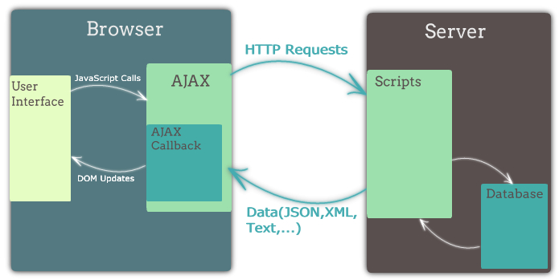
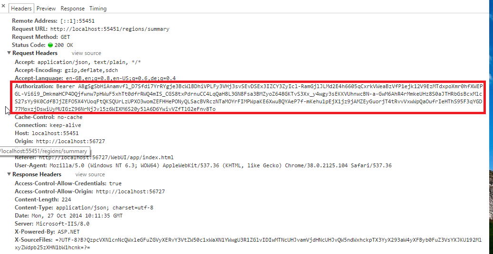

2주차 : 모던 웹 서비스의 구성요소
# nodeJS 5일차
1. Ajax
2. CORS
3. JWT
4. Fetch API

<hr>

## HTTP methods 복습
Ajax
- 비동기적인 웹 어플리케이션의 제작을 위한 
클라이언트 측 웹 개발 기법
- ...을 뜻하나 요즈음은 의미가 변형되어 웹 브라우저에서 XMLHttpRequest 혹은 fetch를 이용해서 보내는 HTTP 요청을 통칭하기도 함


Ajax의 장점
- 화면 전체를 다시 로드하지 않고도 내용을 갱신할 수 있어 더 나은 사용자 경험 제공
- 서버의 응답을 기다리는 동안에도 여전히 웹 어플리케이션을 사용 가능
- 필요한 자원만 서버에서 받아오게 되므로 트래픽이 줄어듬

Ajax의 단점
- 클라이언트 구현이 굉장히 복잡해짐

Ajax Library Comparison

- 리엑트에서는 `isomorphic-fetch`를 많이 쓴다고 한다.
- 우리 수업에서는 `Axios`를 많이 쓴다고 한다.


Axios + json-server [예제](https://glitch.com/edit/#!/wpsn-axios-example)
1. GET 
2. POST
3. PUT & PATCH 
  - PUT은 넣는 것이고,
  - PATCH는 덮어쓰기 
4. DELTE 삭제

### CRUD
create/read/update/delete

## Axios
> readme.md
### Axios 튜토리얼
리믹스한 후 db.default.json 파일을 .data/db.json 위치에 복사하세요

### Axios
Axios는 최근 인기를 끌고 있는 HTTP client입니다. 브라우저에서 사용하면 XMLHttpRequest를 사용하여 Ajax 요청을 보내고, Node.js에서 사용하면 내장 http 모듈을 이용해 요청을 보냅니다. 사용법이 아주 간단하며 Promise 기반으로 깔끔한 코드를 작성할 수 있습니다.

상단의 Show 버튼을 누르고 개발자 도구의 콘솔을 열어 예제 코드를 입력해보세요. axios 변수가 미리 로드되어 있습니다.

### json-server + express

이 프로젝트는 json-server 패키지를 사용해 REST API를 제공하고 있습니다. json-server는 내부적으로 express를 사용하고 있어서 커맨드라인을 통해서 json-server를 실행시키지 않고 직접 자바스크립트 파일에서 불러와 사용할 수 있습니다. 보통의 express 객체를 사용하듯이 사용할 수 있어서 필요한 경로에 미들웨어를 마음대로 추가할 수 있습니다. json-server 매뉴얼과 server.js 파일을 참고해주세요.

## Not
문자열을 숫자형으로 바꾸는 방법.
1. `parseInt`
  ```js
  try {
    parseInt() // 에러가 나야하는 상황에서는 에러가 나는 것이 좋다.
  } catch
  ``` 
2. `*1`
  undefined *1 = NaN
  ```js
  NaN === NaN
  // false
  // Number.isNaN()을 사용하여 NaN을 판별한다.
  ```

<hr>

# CORS

## Same-origin Policy
## Content-Security-Policy
## CORS
Corss-Origin Resource Sharing
- 클라이언트 측 cross-origin 요청을 안전하게 보낼 수 있는 방법을 정한 표준
- 쉽게 말하면, 스크립트가 전혀 다른 출처를 갖는 API 서버를 사용하려고 하는 상황에서는 뭔가 추가적인 처리를 해주어야 한다는 것!


## Cross-origin 요청의 위험성
아래 상황을 가정해봅시다.<br>
mywebsite.com에서 서비스 중인 웹 사이트는 mywebsite.com/api 에서 REST API를 통해 필요한 정보를 얻습니다. mywebsite.com/api 경로에 대한 인증은 쿠키로 이루어지고 있습니다.
그런데 만약 evil.com 웹 사이트의 스크립트에서 mywebsite.com API에 요청을 마음대로 보낼 수 있다면, 이미 my-website.com 도메인에 대해 브라우저에 저장된 쿠키를 이용해서 API를 마음대로 호출할 수 있을 것입니다.

### Cross-origin 요청 예제
- IE8 이상의 모던 웹 브라우저는 cross-origin 요청에 대해 여러가지 제한을 두고 있음
- cross-origin 요청을 허용하려면, 서버가 특별한 형태의 응답을 전송해야 함
- 만약 서버가 cross-origin 요청을 허용하지 않으면, 웹 브라우저는 에러를 발생시킴

### CORS에 관여하는 응답 헤더
- Access-Control-Allow-Origin
- Access-Control-Expose-Headers
- Access-Control-Max-Age
- Access-Control-Allow-Credentials
- Access-Control-Allow-Methods
- Access-Control-Allow-Headers
- Origin
- Access-Control-Request-Method (preflighted 전용)
- Access-Control-Request-Headers (preflighted 전용)

## CORS - Safe, Unsafe
- GET, HEAD 요청은 safe(읽기 전용)이기 때문에 서버에 요청이 도달한다고 해서 서버의 상태에 영향을 미칠 일은 없으므로, 웹 브라우저는 일단 해당 요청을 보내본다. 만약 서버가 cross-origin 요청을 허용한다고 응답하면 응답을 그대로 사용하고, 그렇지 않으면 에러를 낸다.
- POST, PUT, PATCH, DELETE 등의 메소드는 요청이 서버에 전송되는 것 자체가 위험하므로, 실제 요청을 보내기 전에 서버가 cross-origin 요청을 허용하는지를 알아보기 위해 `시험적으로 요청을 한 번 보내본다`. 이 요청을 `preflighted request`라고 한다.
> 단, 기존 HTML form의 동작방식인 application/x-www-form-urlencoded 혹은 multipart/form-data 형태의 POST 요청은 preflighted request가 발생하지 않음

> safe, unsafe 말고도 다른 원인에 의해 preflighted request가 발생하는 경우가 있는데, 자세한 사항은 MDN 문서를 참고해주세요.


### CORS with credentials
cross-origin 요청에는 기본적으로 쿠키가 포함되지 않으나, XMLHttpRequest 혹은 fetch를 통해서 요청을 보낼 때 쿠키를 포함시키는 옵션을 줄 수 있고 이 때 CORS 요건이 더 엄격해짐

> (Access-Control-Allow-Credentials 헤더 설정 필요, Access-Control-Allow-Origin 헤더에 와일드카드 허용 안됨)

**CORS에는 기본적으로 쿠키를 포함하지 않는다!**
- 쿠키를 포함시키려고 하면, 서버에서 복잡한 설정을 거쳐야한다.
- 쿠키에 관련되 헤더가 `Access-Control-Allow-Credentials`


<hr>

# Access Token & JWT
## 쿠키의 단점
- 쿠키를 지원하는 클라이언트에서밖에 사용할 수 없음
- 적절히 관리되지 않은 쿠키는 보안에 취약하며, 관리를 하려고 해도 CORS 대응이 복잡함.

## Token Based Auth
- 토큰이란, 사용자의 자격증명(아이디, 패스워드 등)을 통해 인증이 이루어진 후, 특정 자원에 대한 자격증명으로서 대신 사용되는 인증 수단
- 서버에 요청을 할 때마다 토큰을 요청에 직접 포함시켜서 전송 (주로 Authorization 헤더에 넣어서 전송)


## Cookie vs Token


## 토큰 사용의 장점
- 다양한 인증 수단(전화번호, 공인인증서, 생체정보 등)의 인증 결과를 토큰이라는 하나의 수단으로 통일할 수 있음
- 쿠키를 사용하지 않음으로써 CORS 관련 문제를 회피할 수 있음

## 토큰 사용의 단점
- 매 요청에 토큰이 포함되게 되므로 적당히 짧은 길이를 유지해야 함
- 토큰 유출에 대한 대비책이 필요 (토큰에 유효기간을 두거나, 유출된 토큰을 강제로 무효화하는 등의 방법을 사용)
- 쿠키와는 다르게, 클라이언트에서 직접 토큰을 저장하고 관리해야 함

## Web Storage
- 브라우저에서 키-값 쌍을 저장할 수 있는 저장소
- 쿠키에 비해 사용하기 편리하고 저장 가능한 용량도 큼(10MB 가량)
- 브라우저 탭이 닫히면 내용이 삭제되는 sessionStorage, 브라우저 탭이 닫혀도 내용이 유지되는 localStrage가 있음


## 보안 상 주의사항
- **실무에서는 `innerHtml`, `textcontent`을 직접사용하면 안된다!!**
- 토큰을 localStorage에 저장하게 되면 자바스크립트로 토큰을 탈취할 수 있게 되므로, 웹사이트에 악성 스크립트를 삽입하는 공격(XSS)에 노출되지 않도록 신경써야 함
- 직접 DOM API를 사용하는 대신 EJS, React 같은 템플릿 언어를 사용하기만 해도 XSS에 대한 방어는 충분함

## JSON Web Token
- 최근 널리 사용되고 있는 토큰 형식의 표준
- 토큰 안에 JSON 형식으로 정보를 저장함
- 보안을 위해 서명 또는 암호화를 사용할 수 있음

## JWT 실습
프론트엔드에서 해야할 이슈.

### 번외 ) veiw engine
1. ejs
`<` : `&lt`
`>` : `&gt`
```js
&lt;script &gt; // html escaping
```
### 번외2) Lets' Encrypt
[Lets' Encrypt로 무료로 HTTPS 지원하기](https://blog.outsider.ne.kr/1178)

### 번외3) 보안을 위해서는
1. `innerHTML`쓰지 않고, 템플릿 언어를 사용
2. 잘 모르는 상태에서 쿠키사용하는 상황

### Virtual DOM
가상 DOM트리를 갖고 있다가. 실제 돔의 변화를 최소화시키면서 변경시켜주는 것.
- WebAudio API
- WebGL
- WebAssembly
- WebComponent