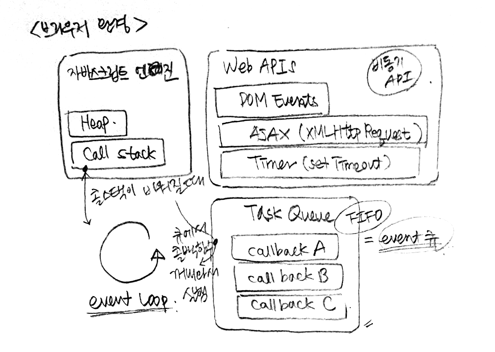
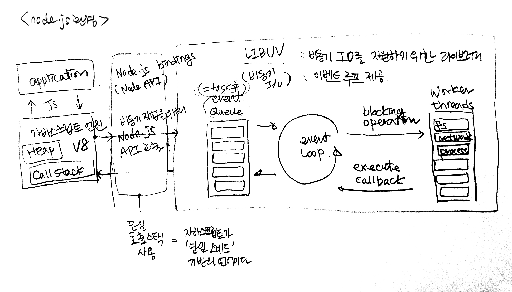
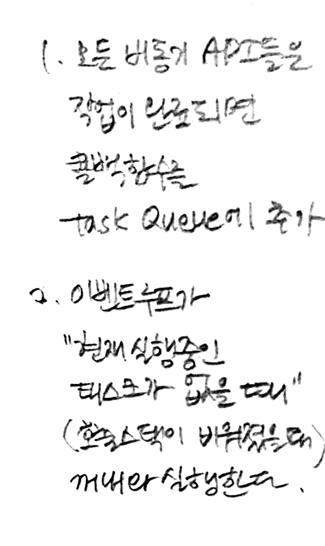

# 이벤트 루프
[비동기 처리과정을 잘 설명한 영상](https://vimeo.com/96425312)  
[(일반)테스크, 마이크로테스크, 큐, 스케줄에 대한 인터렉션이 포함된 좋은 글**](https://jakearchibald.com/2015/tasks-microtasks-queues-and-schedules/) 
[프라미스 참고글](https://promisesaplus.com/#notes) 
[ES6_job Queue](http://www.ecma-international.org/ecma-262/6.0/#sec-jobs-and-job-queues)

## 브라우저 환경

## Node.js 환경

정리
--

