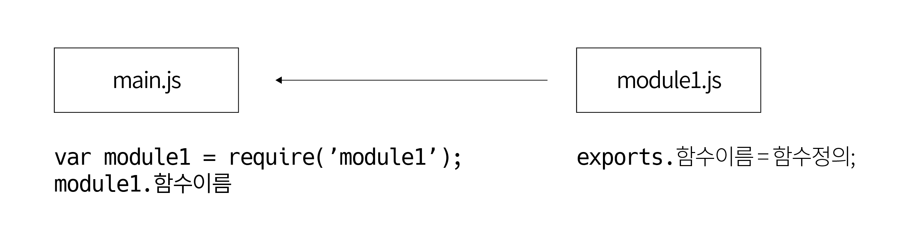

하나의 함수 안에 모든 기능을 넣는 것보다 기능별로 여러 개의 함수로 나눈 후 `필요한 함수만 가져다 사용`하면 다른 곳에서도 이 함수를 재사용할 수 있기 때문에 훨씬 효율적으로 프로그램을 만들 수 있다.

## 모듈이란?
메인 파일의 코드 중에서 독립적인 기능은 별도의 파일로 분리할 수 있으며, 메인 파일에서는 전체적인 실행 순서나 흐름만을 제어한다. 이렇게 분리된 파일을 노드에서는 모듈이라고 부른다. 모듈을 불러와서 사용할 수 있기도 해야한다. `exports 전역객체`를 사용한다.



### module.export
- `exports`에는 속성을 추가할 수 있어, 여러 개의 변수나 함수를 각각의 속성으로 추가할 수 있다.
- `module.exports`에는 하나의 변수나 함수 또는 객체를 직접 할당한다. 일반적으로 객체를 그대로 할당하며, 이렇게 할당한 객체 안에 넣어 둔 변수나 함수를 메인 파일에서도 사용할 수 있다.

```js
// name.js

// `module.exports`에 저장한 값은 다른 모듈에서 불러올 수 있음
// 하나의 변수나 함수 또는 객체를 직접 할당한다.
module.exports = {
  familyName: '김',
  givenName: '승하',
  fullName: function() {
    return this.familyName + this.givenName
  }
}
```
```js
// calc.js

// `exports`로도 참조 가능
// 여러개의 변수나 함수를 각각의 속성으로 추가할 수 있다.
exports.add = (x, y) => x + y
exports.sub = (x, y) => x - y
```
```bash
// Node.js 내장 모듈과는 다르게 경로를 지정해야 함
> const name = require('./name')
undefined
> name
{ familyName: '김',
  givenName: '승하',
  fullName: [Function: fullName] }
> name.familyName
'김'
> name.fullName()
'김승하'
> require('./calc').add(1, 2)
3
```