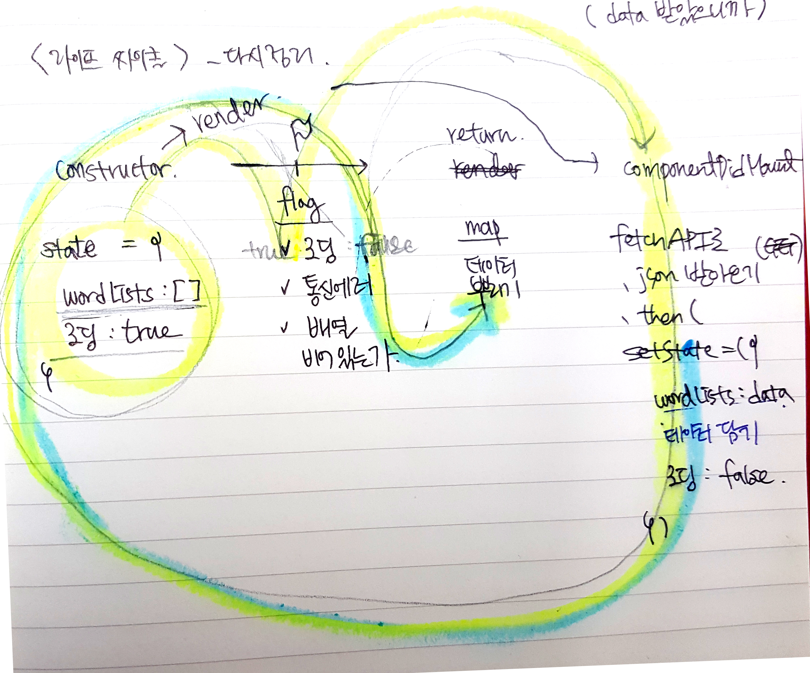

[수업자료](http://slides.com/sohpaul/introduction-to-react#/)
1. Full stack dev setup complete : GET, 
  1. FETCH API
2. Full stack dev setup complete : POST
3. Event

## 0. 번외 ) git branch
git branch를 단계별로 생성하여서 작업후 코드를 보며 학습했다.
1. 선생님 git clone
2. day-4-endpoint로 깃 checkout (선생님 깃에서 마지막 브랜치이다.)
3. 해당 브랜치에서 새로운 브랜치 생성, checkout (nayoung이라는 브랜치 생성)
4. 해당 브랜치에서 작업 후 다음 단계 넘어갈 때 checkout 후 선생님 다음 브랜치로 이동
> 여기서 오류가 날 경우 git stash를 통해 nayoung 브랜치에서 작업한 내용을 잠시 치워둠.
> 나중에 보고 싶은 경우 stash했던 브랜치로 이동, `git stash pop`을 입력해서 꺼낸다.

* stash를 통해서도 에러가 날 경우 2가지 ) 
 > 아예 새로운 파일이 있을 경우 (바꿀 브랜치와 현재 브랜치 사이에서) : 제거해야한다.
 > commit이 안되있을 경우 : commit만 하면 된다.


# 1. Full stack dev setup complete : GET
  1. postman 사용
    - postman으로 데이터 서버 url로 접속, GET상태 확인
    - params 추가하여 GET상태 확인
  2. fetch api 사용
    * AXIOS와 비슷한 PROMISE 기반의 HTTP REQUEST API
    > `XMLHttpRequest` 

## 2. fetch API
```js
fetch(url)
.then(()=>{
  // 응답을 조금 더 처리하는 곳
})
.then(()=>{
  // 응답(DATA)을 받는 곳
})
.catch(()=> {
  // 에러를 받는 곳
})
```


### 실습
1. 전체 wordsList를 출력
2. List 중 하나의 카드에 들어간 후 wordList를 출력
  - fetch url 뒷부분에 `아이디값/words`를 넣어야 한다. (postman으로 미리 확인가능)
    ```js
    const wordListId = this.props.match.params.wordListId;
    ```
    - `this.props.match`는 제일 조상인 라우터의 메소드이다. 
    - match메소드에는 `params, isExact, path, url` 4가지 프로퍼티가 존재한다. 
    - app.js에서 `<Route path="/word-list/:wordListId" component={WordList} />`, 여기서 url뒤에 붙은 wordListId와 `this.props.match.params.wordListId`와 같다.
    > [라우터 참고](https://reacttraining.com/react-router/web/api/match)
3. 카드의 id와 word의 id가 겹칠 수 있으므로, 고유 key값을 적용한다.  


# 2. Full stack dev setup complete : POST
> 순서 : 1. 정보를 받는 form에서 value값 셀렉 > 2. value값을 담은 객체를 POST로 보냄 > 3. 새로 담아진 데이터를 다시 보여주게함 (no reloading)

## 1. 정보를 받는 form에서 value값 셀렉 
> 순서: 1. value의 state 변화를 감지함 > 2. state변화가 감지되면 다시 setState
> 변화 감지 : 핸들링 함수 셋팅(setState) > 이벤트에 함수를 호출.


## 2. value값을 담은 객체를 POST로 보냄 
> 순서 : value값을 객체에 넣기(requestBody) > 해당 객체를 fetch POST로 보냄
담은 정보를 보내야 하므로, 두번째 인자로 정보 객체를 준다.
- 데이터를 보내야 하므로 제출 버튼의 `onclick 이벤트`에 fetchAPI를 추가
```js
fetch(url , {option})
.then(()=>{
  // 응답을 조금 더 처리하는 곳
})
.then(()=>{
  // 응답(DATA)을 받는 곳
})
.catch(()=> {
  // 에러를 받는 곳
})
```
```js
// 예제
fetch("/echo/json/",
{
    headers: {
      'Accept': 'application/json',
      'Content-Type': 'application/json'
    },
    method: "POST",
    body: JSON.stringify({a: 1, b: 2})
})
.then(function(res){ console.log(res) })
.catch(function(res){ console.log(res) })
```

## 3. 새로 담아진 데이터를 다시 보여주게함 (no reloading)
### form안에 button이 있으면 html은 reloading한다.
- 해결방법
  - 전체 GET을 하는 방법, setState로 다시 상태를 변화시키는 방법
  - 후자를 추천


# 3. Event
> UX와 연관지어서 생각
## userFlow + feature
목표 :  새로운 단어장을 만들고 싶다.
1. 새로운 단어장 만들기 버튼 누르기
  1. 매번 단어장 입력을 원하진 않기 때문에 필요할 때만 입력할 수 있도록 한다. (`toggle`)

2. 단어장에 이름 입력, 단어장 설명 입력
  1. 두가지 데이터 전부 primary key로 받는다. (`||,&& 연산자`)
  2. 입력값이 둘중 하나라도 없으면 버튼을 비활성화 시킨다. (`button의 disabled`)
  3. 단어를 입력하다가 취소버튼을 누를 수 있다. 
    - 취소 <-> 토글 연결 
    - 취소를 누르면 입력했던 value값을 없앤다. (`clearInput 함수`)

3. 버튼 누르기
  1. 입력값이 다 들어오면 버튼을 활성화 시킨다. 
  2. 통신이 느릴경우를 대비하여 > post되는 동안 버튼을 비활성화 시킨다. > 비활성화 보다는 loading애니메이션을 넣어서 넘어가고 있다는 표시를 해준다. (`class 이름에 loading`)

# 내일) Redux
라우터보다 더 상위개념이 들어온다. (state). 하위에서 위로 올라갈때 props로 접근하는 것이 아니라, 바로 접근이 가능하도록 한다.

