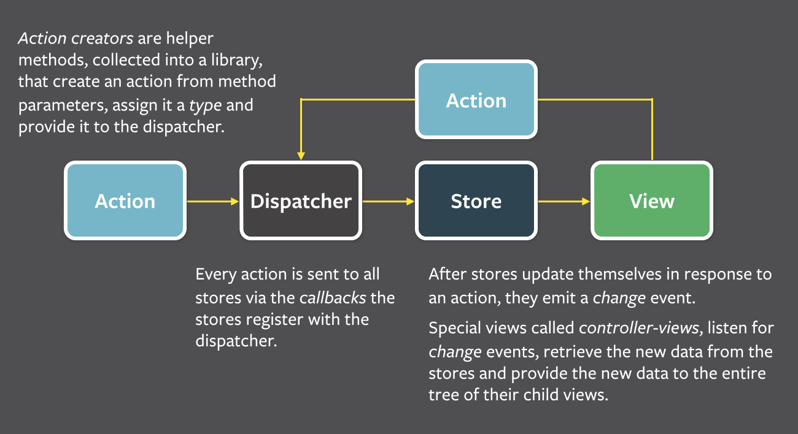
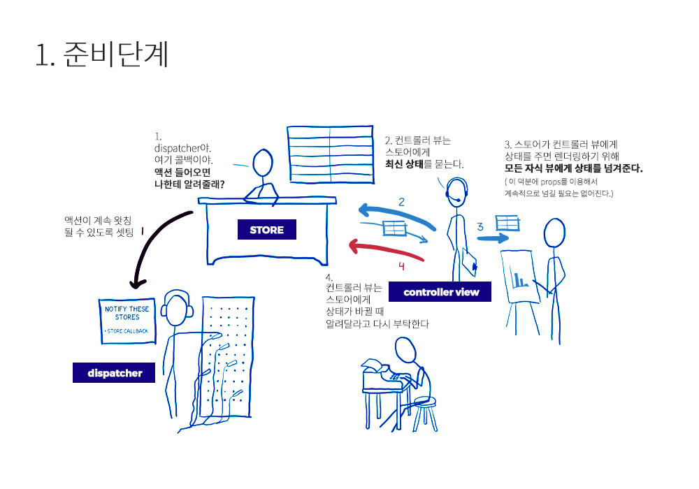
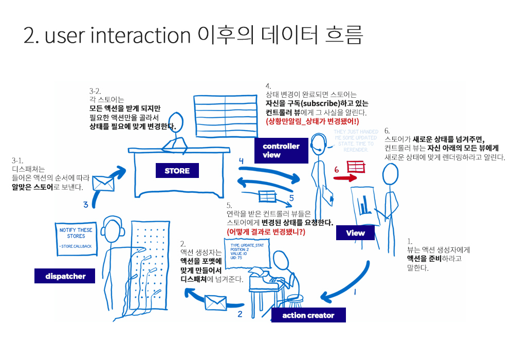
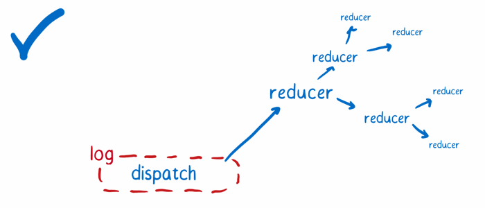
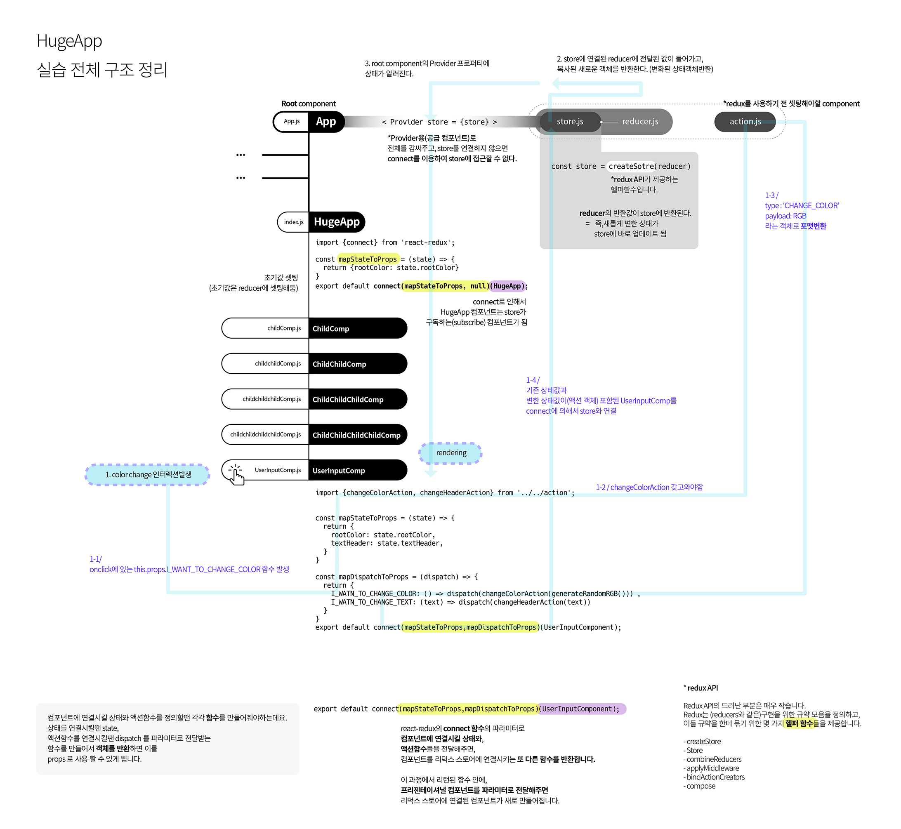

[수업자료](http://slides.com/sohpaul/introduction-to-react#/)
1. Flux
    - 1.1 flux 카툰 안내서
        - 1.1.1 준비단계
        - 1.1.2 when user interaction entered 
2. redux
    - 2.1 redux의 특징
    - 2.2 redux는 flux의 단점을 보안한 라이브러리
    - 2.3 redux 카툰안내서

> 참고

[redux카툰안내서](http://bestalign.github.io/2015/10/26/cartoon-intro-to-redux/)
[]()

---
1. 궁금
- ~reducer에 action을 import 안했는데도 나온다.~
> 전체 flow를 확인하면 알 수 있다.
---



# 1. flux
## 1.1 flux 카툰 안내서
### 1.1.1 준비단계
1. 어떤 액션을 받았을 때, dispatcher가 받은 액션을 통제해서 store에 있는 데이터를 업데이트한다. 
2. 변동된 업데이트가 있으면 view에서 re-rendering. 
3. view에서 store에 직접 접근하지 않는다. 
4. view에서 dispatcher로 직접 액션을 보낸다. 그리고 dispatcher에서는 작업이 중첩되지 않도록 해준다. 즉, 어떤 액션이 dispatcher를 통하여 store에 있는 데이터를 처리하고, 그 작업이 끝날때까지 dispatcher에서 액션을 대기시킨다. (동기) : `우선권을 갖은 액션부터 처리하므로, 꼬이지 않는다.`



### 1.1.2 유저 인터랙션이 들어올 때, 
1. 뷰는 액션 생성자에게 액션을 준비하라고 말한다.
2. 액션 생성자는 액션을 포맷에 맞게 만들어서 디스패쳐에 넘겨준다.
3. 디스패쳐는 들어온 액션의 순서에 따라 알맞은 스토어로 보낸다. 각 스토어는 모든 액션을 받게 되지만 필요한 액션만을 골라서 상태를 필요에 맞게 변경한다.
4. 상태 변경이 완료되면 스토어는 자신을 구독(subscribe)하고 있는 컨트롤러 뷰에게 그 사실을 알린다. (상황만알림_상태가 변경됐어!)
5. 연락을 받은 컨트롤러 뷰들은 스토어에게 변경된 상태를 요청한다.(어떻게 결과로 변경됐니?)
6. 스토어가 새로운 상태를 넘겨주면, 컨트롤러 뷰는 자신 아래의 모든 뷰에게 새로운 상태에 맞게 렌더링하라고 알린다.



---

# 2. redux는 flux 아키텍쳐의 구현체
- 각 노드들은 컴포넌트이다.
- 컴포넌트들은 store에 데이터를 담고, 
  - 스토어에 있는 데이터를 업데이트하고, 
  - subscribe 해당 컴포넌트에서 store에 있는 특정 데이터의 변화를 주시했다가 변동이 있을 시 반영한다.
- subscribe는 컴포넌트에 연결시켜놓으면된다.
- 아래 그림에서 주황색 컴포넌트에서 초록색 컴포넌트로 데이터교류가 필요할 시에는, redux가 없다면 주황컴포넌트에서 parent를 여러번 한후 접근해야한다.
- 하지만 redux사용시, store에 데이터를 저장하면, subscribe하고 있는 초록색 컴포넌트에 반영이된다.


## 2.1 redux의 특징
1. Single Source of Truth
- 모든 진실은 하나의 근원에서 부터 나온다.
- 즉 단 한계의 store만 사용한다.
- flux에서는 여러개의 store를 사용하지만, redux에서는 하나의 store만 사용한다.

2. state는 읽기 전용이다!
- 어플리케이션에서 state를 직접 변경할 수 없다. 
- state를 변경하기 위해서는 action이 dispatch 되어야 한다.

3. 변화는 순수 함수로 만들어져야 한다.
- `action 객체를 처리하는 함수를 reducer`라고 부른다.
- reducer는 변화를 일으키는 함수
- reducer는 정보를 받아서 상태를 어떻게 업데이트 할 지 정의한다.
- reducer는 '순수함수'로 작성되어야 한다.!
    - 비동기처리를 하면안된다는 뜻이다.
    - 즉, 네트워크 및 데이터베이스 접근 안되며, 인수 벼경도 안된다.
    - 같은 인수로 실행된 함수는 언제나 같은 결과를 반환
    - '순수하지 않은' API 사용 불가 (Date.now(),Math.random())

## 2.2 redux는 flux의 단점을 보안한 라이브러리
### redux는
만약에 상태를 변경하고 싶다면 액션을 발생시켜야 한다. 
상태를 저장하고 있는 스토어(store)는 `접근자(getter)`만 있고 설정자(setter)는 없으므로 직접적으로 상태를 바꿀 방법이 존재하지 않는다. 이런 기본적인 점은 Flux와 Redux가 아주 비슷하다.

### 단점1. 스토어의 코드는 application 상태를 삭제하지 않고는 reloading이 불가능하다.
Flux에서 스토어(store)는 다음의 두 가지를 포함한다:
1. 상태 변환을 위한 로직
2. 현재 애플리케이션 상태
스토어 객체 하나가 이 두 가지를 가지고 있는 것은 핫 리로딩을 할 때 문제점을 만든다. 새로운 상태 변환 로직(state change logic)을 위해 
- 스토어 객체를 리로딩하면 스토어에 저장되어있는 기존의 상태까지 잃어버리는 데다가 
- 스토어와 시스템의 나머지 부분 사이에 있는 이벤트 구독(event subscription)까지 망가져 버린다.

### 해결방법
두 기능 분리하기.
- 한 객체는 `애플리케이션 상태`만을 가지게 하고, 이 객체는 리로딩하지 않도록 하자. 
- 또 다른 객체는 모든 `상태 변환 로직`을 가지도록 하자. 이 객체는 상태를 가지고 있지 않으므로 걱정없이 리로딩 할 수 있을 것이다.

---

### 단점2. 애플리케이션 상태는 매 액션마다 재기록된다.
- 시간 여행 디버깅을 위해서는 상태 객체의 `모든 버전들을 기록`해두어야 한다. 그걸 가지고 쉽게 이전 상태로 돌아갈 수 있다.
- 매번 상태가 새로 바뀔 때마다 이전 애플리케이션 상태를 `상태 객체의 버전들을 저장하는 배열`에 추가할 필요가 있다. 하지만 JavaScript의 동작방식 때문에 단순히 상태를 가진 변수를 배열에다가 추가하는 것만으로는 부족하다. `이 방식으로는 애플리케이션 상태의 스냅샷(snapshot)을 생성하는게 아니라 같은 객체를 가리키는 새로운 포인터(pointer)를 만들 뿐이다.`
- 제대로 동작하게 만들기 위해서는, 각각의 버전이 완벽히 독립된 객체가 될 필요가 있다. 그러면 이전 상태들이 실수로 수정되는 일은 일어나지 않을 것이다.

### 해결방법
액션이 스토어로 전달되었을때 기존의 애플리케이션 상태를 수정하는 대신, 그 상태를 `복사한 뒤 복사본`을 수정하면 된다.

---

### 단점3. 서드파티 플러그인이 들어갈 좋은 장소가 없다.
- 개발자 도구는 여러 곳에 쉽게 쓰일 수 있도록 만들어야 한다. 사용자는 자신의 코드를 수정하지 않고도 간단히 코드 몇 줄을 집어넣는 것만으로 개발자 도구를 사용할 수 있어야 한다.
- 이렇게 하기 위해서는 기존의 코드에 서드파티 플러그인을 추가할 수 있는 장소인 `확장점(extension point)`이 필요하다.
- 관련 예제 중 하나로는 로깅(logging)이 있다. 매 액션마다 console.log()를 실행한다고 가정해보면, 액션이 들어왔을 때 그 액션의 결과로서 만들어지는 새로운 상태를 로깅할 것이다. Flux에서는 디스패쳐(dispatcher)의 업데이트와 각 스토어의 업데이트를 구독(subscribe)해야만 한다. 하지만 이것은 서드파티 모듈(third-party module)이 쉽게 할 수 있는 것이 아니다.

### 해결방법
- 시스템의 부분을 다른 객체들로 쉽게 감쌀 수 있게 만들어보자. 이 객체들은 약간의 추가 기능들을 시스템의 부분에 추가한다. 
- 이런 확장점(extension point)을 “enhancer” 또는 “higher order” 객체 혹은 미들웨어(middleware)라고 부른다는 것을 알 수 있다.
- 또한, 상태 변환 로직(state change logic)을 트리를 사용해서 구조화하자. 상태가 변했다는 것을 뷰에게 알리기 위해 `스토어는 단 하나의 이벤트만 보내면 될 것이다.` 이 이벤트는 모든 상태 트리가 처리 된 뒤에 보낸다.



## 2.3 redux 카툰안내서
필요한 요소 : store / reducers / smart&dumb component / root component / view layer binding / 
### * store
Redux의 스토어는 좀 더 일을 다른 곳에 위임하는 경향이 있으며, 그렇게 해야만 한다. 왜냐하면, Redux는 단 하나의 스토어만을 가지기 때문이다. 만약 혼자서 모든 것을 처리하려고 한다면 아마 처리할 양이 너무 많을 것이다.
- 대신, Redux의 스토어는 `상태 트리(state tree) 전체를 유지하는 책임을 진다.` 액션이 들어왔을 때 어떤 상태변화가 필요한지에 대한 일은 위임하며, 바로 다음에 이야기할 리듀서(reducer)가 그 일을 맡는다.
- 아마 디스패쳐(dispatcher)가 없다는 것을 눈치챘을지도 모른다. 이것은 스토어가 이 일을 넘겨받았기 때문이다.

---
### * reducers
- 변화를 일으켜주는 함수!
스토어는 액션이 어떤 상태 변화를 만드는지 알 필요가 있을 때 리듀서에게 묻는다. **루트 리듀서(root reducer)는 애플리케이션 상태 객체의 키(key)를 기준 삼아 상태를 조각조각 나눈다.** 이렇게 나누어진 상태 조각은 그 조각을 처리할 줄 아는 리듀서로 넘겨준다.

리듀서는 마치 서류 복사에 지나치게 열성적인 사무실 직원들과 같다. 일을 망치는 것에 아주 민감하므로 넘겨받은 예전 상태는 변경하지 않는다. 대신 `새로운 복사본`을 만든 후 거기에다가 모든 변경사항을 적용한다.

- 이것이 바로 Redux의 키 아이디어 중 하나이다. `상태 객체는 직접 변경되지 않는다.` **대신, 각각의 상태 조각이 복사 후 변경되고 새로운 상태 객체 하나로 *합쳐진다.***
- 리듀서는 복사되고 업데이트된 상태 객체를 `루트 리듀서`에게 넘겨주고, 루트 리듀서는 이 객체를 `스토어`로 보낸다. 그리고 스토어는 이 객체를 새로운 애플리케이션 상태로 만든다.
- 만약 작은 애플리케이션이라면 하나의 리듀서만 가지고도 전체 상태의 복사본을 만들고 상태를 변경할 수 있다. 아주 큰 애플리케이션이라면, 많은 리듀서를 가진 큰 리듀서 트리를 사용할 수도 있다. 이것이 Flux와 Redux의 또 다른 점이다. Flux는 스토어가 서로 연결될 필요도 없고 수평적 구조를 가졌다. 반면 Redux는 리듀서가 트리 모양의 계급구조 안에 존재한다. 이 구조는 컴포넌트 구조처럼 필요한 만큼의 레벨(트리의 높이)을 얼마든지 가질 수 있다.

---
### * 똑똑한 컴포넌트, 멍청한 컴포넌트 (smart & dumb)
#### 똑똑한 컴포넌트는 : 관리자
- 똑똑한 컴포넌트는 액션 처리를 책임진다. 똑똑한 컴포넌트 밑의 멍청한 컴포넌트가 액션을 보낼 필요가 있을 때, 영민한 컴포넌트는 props를 통해서 멍청한 컴포넌트에 함수를 보낸다. 멍청한 컴포넌트는 받은 함수를 콜백으로써 단순히 호출만 한다.
- 똑똑한 컴포넌트는 자기 자신의 CSS style을 가지고 있지 `않다.`
- 똑똑한 컴포넌트는 자기 자신의 DOM을 거의 가지고 있지 않다. 대신, DOM 요소들을 관리하는 멍청한 컴포넌트들을 관리한다.

#### 멍청한 컴포넌트
멍청한 컴포넌트는 액션에 직접 의존성을 가지지는 않는다. 이는 모든 액션을 `props`를 통해서 넘겨받기 때문이다. 이말인 즉슨, 멍청한 컴포넌트는 다른 로직을 가진 다른 애플리케이션에서 재사용될 수 있다는 뜻이다. 또한 어느정도 보기좋게 할만큼의 CSS style도 포함하고 있다 **(따로 style props를 받아 기본 style에 병합시켜서 style을 바꿀수도 있다).**

---
### * view layer binding
스토어와 뷰를 연결하기 위한 장치가 필요하다. 이걸 해주는 것이 바로 뷰 레이어 바인딩이다. React를 사용한다면 react-redux가 그것이다.

- 뷰 레이어 바인딩은 뷰 트리(view tree)를 위한 IT 부서와 같다. `모든 컴포넌트를 스토어에 연결하는 역할을 하며,` 많은 기술적인 세부사항들을 처리해서 트리 구조가 세부사항에 신경 쓰지 않도록 해준다.

뷰 레이어 바인딩은 세 개의 컨셉을 가지고 있다:

1. 공급 컴포넌트(provider component): 컴포넌트 트리를 감싸는 컴포넌트이다. `connect()`를 이용해 루트 컴포넌트 밑의 컴포넌트들이 스토어에 연결되기 쉽게 만들어준다.
```js
// 실습코드
import React, {Component} from 'react';
import {Provider} from 'react-redux';

class App extends Component {
  render(){
    return(
    <BrowserRouter>
      <Provider store={store}>
        <div>
          <div className="ui attached stackable menu">
            <div className="ui container">
              {routes.map((route) => <HeaderItem
                key={route.linkLabel}
                linkTo={route.linkTo}
                label={route.linkLabel}/>)}
            </div>
          </div>

          <div className="ui divider hidden"></div>
          <div className="ui hidden divider"></div>
          <Route path="/quiz-session" component={QuizSession}/>
          <Route path="/quizes" component={Quizes}/>
          <Route path="/word-lists" component={WordLists}/>
          <Route path="/word-list/:wordListId" component={WordList}/>
          <Route path="/zigbangroomlist" component={ZigbangRoomList}/>
          <Route path="/hugeapp" component={HugeApp}/>
        </div>
      </Provider>
    </BrowserRouter>
    )
  }
}
```
2. connect(): react-redux가 제공하는 함수이다. 컴포넌트가 애플리케이션 상태 업데이트를 받고 싶으면 `connect()`를 이용해서 컴포넌트를 감싸주면 된다. 그러면 connect()가 셀렉터(select)를 이용해서 필요한 모든 연결을 만들어준다.
```js
// 실습코드
export default connect(mapStateToProps,mapDispatchToProps)(UserInputComponent);
```
3. 셀렉터(selector): 직접 만들어야 하는 함수이다. 애플리케이션 상태 안의 어느 부분이 컴포넌트에 props로써 필요한 것인지 지정한다.

---
### * 루트 컴포넌트 the Root component
모든 React 애플리케이션은 `루트 컴포넌트`를 가진다. 이것은 단지 컴포넌트 계층 구조에서 가장 위에 위치하는 컴포넌트일 뿐이다. 하지만 Redux에서는 루트 컴포넌트는 추가로 책임져야 할 것이 존재한다.
루트 컴포넌트가 맡는 임무는 마치 C-level 임원과 같다 – C-level 임원에는 CEO, CTO, CFO 등이 있다. 
- 루트 컴포넌트는 모든 팀이 일을 하도록 하는 임무를 가진다. 
- 스토어를 생성하고 무슨 리듀서를 사용할지 알려주며 뷰 레이어 바인딩과 뷰를 불러온다.

하지만 루트 컴포넌트는 애플리케이션을 초기화한 뒤로는 거의 하는 일이 없다. 화면을 갱신도 더는 신경 쓰지 않는다. 화면 갱신은 뷰 레이어 바인딩의 도움으로 아래의 컴포넌트들이 맡아서 처리한다.
> 실습코드에서는 App.js


## 준비단계 ~ 데이터 흐름



## 수업시간 메모
* 렌더만 필요한 상황이면 함수만 생성해도 된다. 따로 class없이 . 
> stateless component

* rdeuce 장점들
- 직접 바뀔일이 없다 => 에러 발생할 여지 적다
- action이 들어올때 마다 새로운 state가 생긴다
- 기존 State들을 보존하면 => 시간 여행 가능 : 디버깅 가능.

* reduce의 이벤트 인자는 형태가 정해져있다.
버튼 클릭 => Action 발생
            action = { `type`: 'CLICK', `payload`: '...' }

* 개념은 reduce와 redux와 같다.
* 최상단에 컴포넌트를 더 감싸고, store를 추가한다. 

## 실습
1. redux는 따로 셋팅
```bash
$ npm install --save redux react-redux
```

2. 필요한것 3가지
* reducer
* action
* store : state에 dispatch된다.
```js
<div onClick={() => changeColorAction(generateRandomRGB())}>
/*
위처럼 하면 store에서 안받아준다. dispatch화 하여 넘겨야한다.
인자없이 함수만 넘길 때는 this.props.changeRootColor로 넘겨도 됨
인자를 넘겨하야 하기 때문에 괄호를 넣어야하는데, 괄호를 넣는 순간 실행이 되기 때문에 에러가 난다.
때문에 함수 형태로 넘겨주어야 한다. 
*/
```


- store.state => 잘 꺼내서 사용해라
- store.dispatch => 너가 발생시키고 싶은 액션들 잘 연결해서 객체로 리턴해라.

```js
<Provider store={store}>
connect(
  <!-- 내가 보고 싶은 state값들을 객체로 리턴하는 함수, -->
  <!-- 내가 발생시키고 싶은 actions들을 객체로 리턴하는 합수 -->
)(Component)
```

3. 다음시간) redux 미들웨어
