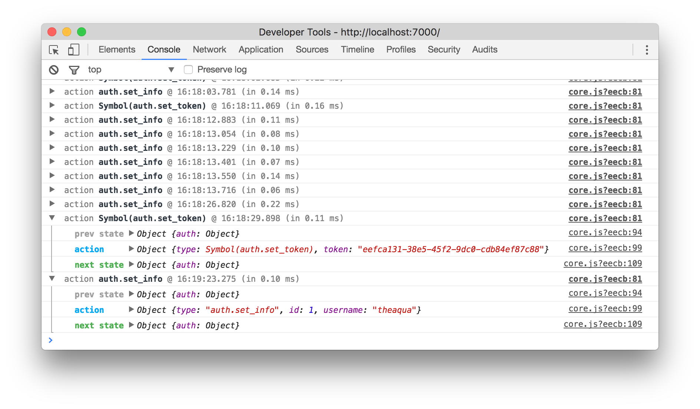

[수업자료](http://slides.com/sohpaul/introduction-to-react#/)
1. 저번주 redux 셋팅 복습 
2. 미들웨어 설치하기 (logger, thunk)
3. reducer 쪼개기
----

# 1. 저번주 redux 셋팅 복습 
> 최소 3번씩 연습

> 데이터 흐름을 잘 파악하자

# 2. 미들웨어 설치하기 (logger, thunk)

```js
npm install --save redux-logger
npm install --save redux-thunk
```
## 2.1 logger
Action과 Store의 State 변화를 로깅해서 보여주는 미들웨어
```js
// store.js

import {createStore, applyMiddleware} from 'redux' // redux의 applyMiddleware 함수를 사용한다.
import logger from 'redux-logger'

const createStoreWithMiddleware = applyMiddleware(thunk,logger)(createStore)
// thunk는 뒷부분에 설명이 나온다.
// 적용할 미들웨어를 인자로 모두 담는다. 
const store = createStoreWithMiddleware(reducers)
// reducer를 인자로 주면서 store를 생성한다.

export default store;
```
- 디버깅 할때 좋다.
- 이전상태 + action + 다음상태
  
- 배포 시 (npm build) logger를 숨기고 배포한다.
  - `process.env.NODE_ENV !== 'production'`
    ```js
    let middleware = [ a, b ]
    if (process.env.NODE_ENV !== 'production') {
      let c = require('some-debug-middleware')
      let d = require('another-debug-middleware')
      middleware = [ ...middleware, c, d ]
    }

    const store = createStore(reducer, preloadedState, applyMiddleware(...middleware))
    ```

> 주의: 다른 미들웨어와 함께 사용시, logger는 맨 마지막에 넣어주어야 한다. logger 

## 2.2 thunk
thunk란, 특정 작업을 나중에 하도록 미루기 위해서 함수형태로 감싼것을 칭합니다.
- 가장 간단히 설명하자면, 이 미들웨어는 객체 대신 함수를 생성하는 액션 생성함수를 작성 할 수 있게 해줍니다. 리덕스에서는 기본적으로는 액션 객체를 디스패치합니다. 일반 액션 생성자는, 다음과 같이 파라미터를 가지고 액션 객체를 생성하는 작업만합니다

```JS
const actionCreator = (payload) => ({action: 'ACTION', payload});
```

# 3. 리듀서 분할하기

## Reducer(currentState, action) => nextState

* 현재 state가 직접 바뀌는 것이 아니라, 새로운 state가 새롭게 생성된다. (immutable)
* action이 들어올때마다 새로운 state가 생긴다.

지금까지 구현한 reducer.js는 색상, 텍스트, 데이터로드와 같은 각각 다른 기능을 하는 다양한 리듀서들이 혼재되어있다. 유지보수 측면에서나 가독성 측면에서 각 리듀서들을 분리하는 것이 좀 더 바람직해 보인다.

```js
// reducer.js
const DEFAULT_STATE = {
  isLoading: false,
  errorState: false,
  rootColor: [42, 133, 234],
  wordLists: [],
  headerText: 'This is the Header',
}

const reducer = (
    state=DEFAULT_STATE,
    action
) => {
    if (action.type === 'GET_WORDLSIT_SUCCESS') {
    return {
      ...state,
      isLoading: false,
      wordLists: action.payload,
      };
    }
    if (action.type === 'GET_WORDLIST_REQUEST') {
      return {
        ...state,
        isLoading: true,
      };
    }
    if (action.type === 'GET_WORDLIST_FAILED') {
      return {
        ...state,
        isLoading: false,
        errorState: true,
      };
    }
    if (action.type === 'CHANGE_COLOR') {
        return {
            ...state,
            rootColor: action.payload,
        }
    }
    if (action.type === 'CHANGE_HEADER') {
        return {
            ...state,
            headerText: action.payload,
        }
    }
    return {
        ...state,
    }
}

export default reducer;
```

위 파일을 각 기능별로 분리하여 3개의 리듀스 파일로 나누고, 최종적으로 redux의 `combineReducers`를 이용하여 다시 하나의 파일로 결합할 것이다. 파일 구조를 아래와 구성한다.

```
reducers/
|________color.js
|________header.js
|________index.js
|________words.js
```

리듀서들을 담을 reducers 폴더를 생성하고, 그 안에 `color.js`, `header.js`, `index.js`, `words.js` 파일을 각각 생성한다.

```js
//color.js
const INITIAL_STATE = {
  rootColor: [42, 133, 234],
};

const colorReducer = (state = INITIAL_STATE, action) => {
  if (action.type === 'CHANGE_COLOR') {
    return {
      ...state,
      rootColor: action.payload,
    };
  }
  if (action.type === 'CHANGE_HEADER') {
    return {
      ...state,
      headerText: action.payload,
    };
  }
  return {
    ...state,
  };
};

export default colorReducer;
```

앞선 `reduce.js`파일에서 color와 관련된 부분만 분리하여 colorReducer로 만든 후, export한다. 나머지 words와 header도 마찬가지로 구성한다.

```js
// words.js
const INITIAL_STATE = {
  isLoading: false,
  errorState: false,
  wordLists: [],
};

const wordsReducer = (state = INITIAL_STATE, action) => {
  if (action.type === 'GET_WORDLSIT_SUCCESS') {
    return {
      ...state,
      isLoading: false,
      wordLists: action.payload,
    };
  }
  if (action.type === 'GET_WORDLIST_REQUEST') {
    return {
      ...state,
      isLoading: true,
    };
  }
  if (action.type === 'GET_WORDLIST_FAILED') {
    return {
      ...state,
      isLoading: false,
      errorState: true,
    };
  }
  return {
    ...state,
  };
};

export default wordsReducer;
```

```js
// header.js
const INITIAL_STATE = {
  headerText: '',
};

const headerReducer = (state = INITIAL_STATE, action) => {
  if (action.type === 'CHANGE_HEADER') {
    return {
      ...state,
      headerText: action.payload,
    };
  }
  return {
    ...state,
  };
};

export default headerReducer;
```

이제 세 개의 리듀스를 한 파일로 결합시켜줄 것이다. 아래처럼 redux의 combineReducers 함수를 사용해 하나의 파일로 만들 수 있다.

```js
// index.js

// 앞서 생성한 color, words, header 리듀서를 import
import colorReducer from './color';
import wordsReducer from './words';
import headerReducer from './header';
import { combineReducers } from 'redux';

const reducers = combineReducers({
  words: wordsReducer,
  color: colorReducer,
  header: headerReducer,
});

export default reducers;
```

변경된 리듀서 디렉터리 구조에 따라 store에서의 import 디렉터리도 수정한다.

```js
import reducer from './reducers';
```

리듀서의 구조 또한 변경되었으므로 해당 리듀서에 대한 참조 코드 역시 변경해주어야 한다.

```js
// 변경 전
reducer: {
  isLoading: false,
  errorState: false,
  rootColor: [42, 133, 234],
  wordList: [],
  headerText: 'This is the Header',
}
```

```js
// 변경 후
reducer: {
  words: {
    isLoading: false,
    errorState: false,
    wordLists: [],
  },
  color: {
    rootColor: [42, 133, 234],
  },
  headerText: {
    'This is the Header',
  }
}
```

기존 접근 방식이 `state.wordLists` 였다면, `state.words.wordLists`로 접근해야 한다. 아래처럼 코드를 변경해야 한다.

```js
// Pages/WordLists.js
const mapStateToProps = state => ({
  wordLists: state.words.wordLists,
});
```

```js
// Pages/HugeApp/index.js
const mapStateToProps = state => {
  return {
    rootColor: state.color.rootColor,
    headerText: state.header.headerText,
  };
};
```


### Reference
[velopert](https://velopert.com/3401)


------

요청을 보내고 기다리는 상태, 요청이 성공한 상태, 요청이 실패한 상태
```
GET_WORD_LIST_REQUEST
GET_WORD_LIST_SUCCESS
GET_WORD_LIST_FAILED
```


- Testing, : component를 쪼개서 testing한다..
- Server Side Rendering, : 구글이 크롤링 할 수 있도록 한다.
- Code Splitting, : 
- Build / Development Mode, : build모드와 개발모드가 따로 있다.
  ```js
  "build": "react-scripts build"
  ```
- Flow Type Checking,
- Service Workers,