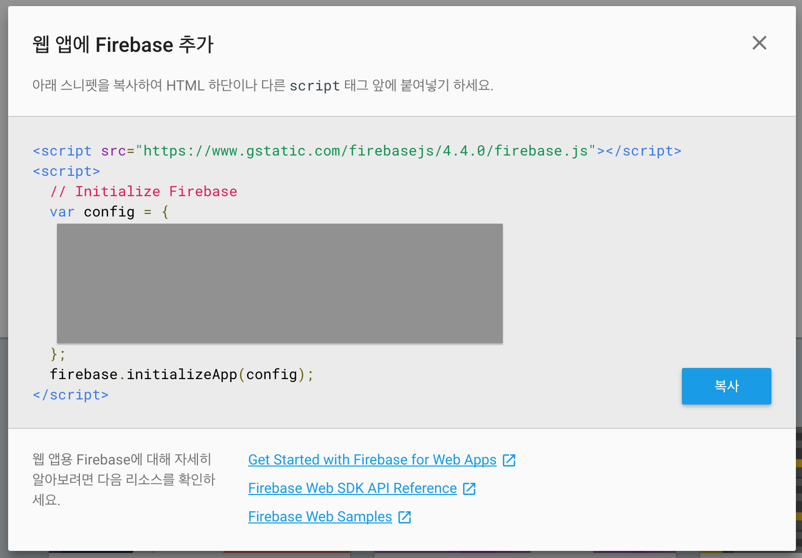
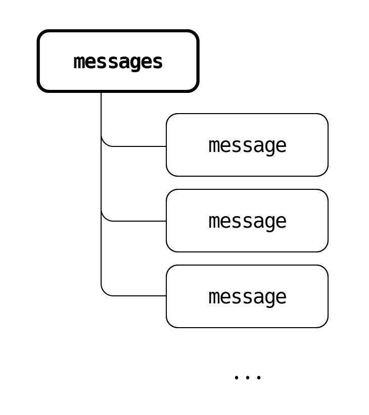

[수업자료](http://slides.com/sohpaul/deck-3#/)


## 채팅앱 만들기
firebase authentication (oauth)<br>
firebase real time database (실시간)<br>
firebase storage<br>
+<br>
REACT / REDUX

- oauth = 기존의 신뢰가 있는 서비스를 보증인으로 로그인을 시키는.
> 소셜 로그인

### 목차

1. firebase 연결하기
2. 데이터 flow 구조 셋팅
    - firebase Realtime database 연동시키기
    - form 입력값 렌더하기
3. 로그인/로그아웃 구현
4. UI 수정
    - scroll 하단으로 고정
    - 새로고침 현상 없애기
    - current user만 highlighting

------

# 1. firebase 연결하기
## 1. [firebase-console] firebase에서 프로젝트 생성

> [firebase](https://console.firebase.google.com/)



복사 버튼을 눌러서 복사한다.

> 폴더트리 셋팅
- chatApp.js
- firebase.js

## 2. firebase 설치
```bash
$ yarn add firebase
```

## 3. firebase에 모듈화하여 chatApp에 import한다.
```js
import firebase from 'firebase'

const config = {
  ...
};
firebase.initializeApp(config);
```

## 4. [firebase-console] Google 로그인
Authentication > Google을 on한다.

## 5. [firebase-console] 데이터 규칙 셋팅
- 일기와 쓰기는 로그인 이후에 가능하도록 한다.
- 로그인 연결 이후이므로, `true`로 셋팅
```json
{
  "rules": {
    ".read": "true",
    ".write": "true"
  }
}
```

## 6. [firebase-console] Realtime Database > 데이터
- 테스트 단계이므로 임의의 트리 셋팅 후, console.log로 출력해보면서 연결을 확인할 예정이다.
- 테스트용: `이름: messagee / 값: 0` 셋팅

## 7. [firebase JavaScript SDK_로그인 처리 흐름] firebase의 Google 제공업체 개체의 인스턴스를 생성합니다.
> [Google sign in tutorial](https://firebase.google.com/docs/auth/web/google-signin?authuser=0)
```js
export const googleProvider = new firebase.auth.GoogleAuthProvider();

export const database = firebase.database()
export const auth = firebase.auth();
```
## 8. chatApp에서 import
> firebase 연동 완료

## 9. 연동 확인
```js
database.ref('/').on('value', (snapshot) => { 
    console.log(snapshot.val()) 
})
```
> 로딩 이후에 콘솔에 객체 이름과 함께 찍히면 ok

---

# 2. 데이터 flow 구조 셋팅
    - firebase Realtime database 연동시키기
    - form 입력값 렌더하기

## 2.1 firebase Realtime database 연동시키기
- 현재 작성되어있는 데이터값 삭제.
```js
database.ref('/').set({}) // 제일 상위 루트의 데이터를 빈 객체로 셋팅한다 = 초기화
```

### db 

DBMS (database management system)
- 관계형 DB
- 우리가 사용할 DB는 NO-SQL
- 하나의 커다란 Object
```bash
root = {
  messages: [

  ],
  users: [

  ]
}
```

1. 서비스 성격에 맞추어 DB 구조를 먼저 생각해보자.
채팅 앱에 필요한 db > **메세지 내용**

2. 메세지 내용 트리 이름 / 개당 메세지 내용
`messages` / `message`


messages는 message 객체를 담는 배열 형태이다. (JSON)

```js
constructor(props){
    super(props);
    this.state = {
      message: '',
      messages: [],
    }
  }
componentDidMount = () => {
  database.ref('/messages').on('value', (snapshot) => { 
    // ref의 경로로 트리 상위구조를 잡는다. 
    // 감지하는데만 포커스 (가져온다는 개념은 없다.)
    this.setState({
      messages: map(snapshot.val(), (message => message))  
      // 여기서 map은 lodash 라이브러리를 사용한 것. 
    })
  })
}
```
위에서 두번재 인자로 들어간 `(message => message)`는 아래 코드와 같다.
```js
map(messages, (message) => {
  return (
    <div>
      {message.text}
    </div>
  )
})
```
> lodash를 설치해야한다.
```bash
$ npm install --save lodash
```
> 사용은 map만 사용할 예정


## 2.2 form 입력값 렌더하기
1. `input`의 value값 onChange 이벤트로 감지하기
2. onTextChange 핸들러 셋팅 (value값과 현재 상태 메시지 값 통일시키기_db 남겨지는 것 방지)
3. form에서 데이터를 넘길 때 onSubmit이벤트를 사용해서 addMessageToDB로 넘긴다. (form에서 넘기기 때문에 form의 특성인 reloading현상을 없애야한다.)
4. addMessageToDB 핸들러에서 입력했을 떄 들어오는 내용 객체를 messages 배열에 추가한다. (`push`)


---
# 3. 로그인/로그아웃 구현
    - 로그인, 로그아웃 버튼 셋팅
    - user 상태셋팅

## 3.1 로그인, 로그아웃 버튼 셋팅
### button 추가
- 현재는 로그인과 로그아웃 전부 셋팅한다.
- onClick 이벤트 걸어두기.
- 현재 작성한 마크업에 넣어도되고, 따로 함수로 분리해도 된다.

### 버튼 추가
- [firebase_구글로그인관련 docs](https://firebase.google.com/docs/auth/web/google-signin?authuser=0)
- 이벤트핸들러_로그인: 구글로 로그인환경 셋팅 `auth.signInWithPopup(googleProvider)`
- 이벤트핸들러_로그아웃

## 3.2 user 상태셋팅
유저의 로그인 상태는 firebase 공식 홈페이지에서 제공하는 코드를 활용한다.<br>
참고 : [인증 상태 변경 관찰자 설정 및 사용자 데이터 가져오기](https://firebase.google.com/docs/auth/web/start?authuser=0)
```js
firebase.auth().onAuthStateChanged(function(user) {
  if (user) {
    // User is signed in.
    var displayName = user.displayName;
    var email = user.email;
    var emailVerified = user.emailVerified;
    var photoURL = user.photoURL;
    var isAnonymous = user.isAnonymous;
    var uid = user.uid;
    var providerData = user.providerData;
    // ...
  } else {
    // User is signed out.
    // ...
  }
});

// 인자에 user가 들어간 경우, 로그인상태
// 없는 경우 로그아웃 상태
```

### 상황1_ 로그인했을때 `if (user)`
1. 상태를 변화시켜야하므로, setState를 셋팅한다.
2. 로그인 이후에만 화면을 로딩하길 원할 경우 마지막에 다시 db를 갖고오는 함수를 셋팅한다.(`getMessagesFromDB`)

### 상황2_ 로그아웃했을때
1. 로그인 상태와 비슷하며, 빈 값으로 상태를 셋팅한다.


---
# 4. UI 수정
    - scroll 하단으로 고정
    - 새로고침 현상 없애기
    - current user만 highlighting

## scroll 하단으로 고정
scoll 하단 고정의 경우, 사용자가 메세지를 입력 후 화면에 그려진 후 지속적으로 마지막 메세지가 보이면서 셋팅이 되어야하므로, componentDidUpdate에 셋팅한다.

> 컴포넌트의 prop이 변경될 때에는<br>
`componentWillReceiveProps` > `shouldComponentUpdate` > `componentWillUpdate` > `render` > `componentDidUpdate`

```js
componentDidUpdate = (prevProps, prevState) => {
  if (prevState.messages.length !== this.state.messages.length) { // 조건을 걸어두어야 새로운 메세지가 들어가도 마지막에 계속 고정이 된다.
    document.body.scrollTop = document.body.scrollHeight;
  }
}
```

## 새로고침 현상 없애기
```js
addMessageToDB = (e) => {
    e.preventDefault();
}
```

## current user만 highlighting
```js
{this.state.currentUser.name === `${message.userName}` ? (
  <article className={`tile is-child notification is-primary`}>
    <p className="title">{message.text}</p>
    <p className="subtitle">{message.time}</p>
    <p className="subtitle">{message.userName}</p>
    <figure className="image is-32x32" >
      
    </figure>
  </article>
) :(
  <article className={`tile is-child notification`}>
    <p className="title">{message.text}</p>
    <p className="subtitle">{message.time}</p>
    <p className="subtitle">{message.userName}</p>
  </article>
) }
```
