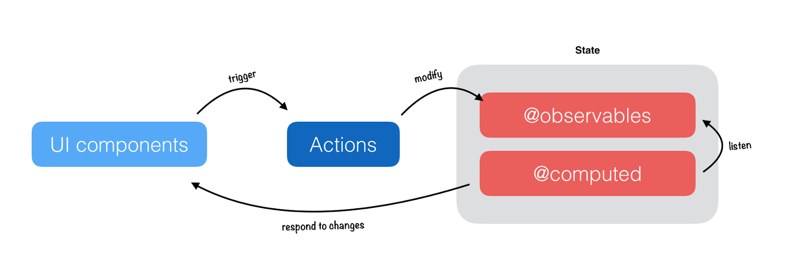

**원래 redux를 셋팅할때는**
1. action의 타입을 변수로 빼서 놓고
2. action 생성자를 만들고
3. 리듀서를 만들고
4. 리듀서를 합치고
5. 스토어를 만들고
6. privider로 넘겨준다...

**mobX는?**
객체를 만드는 개념이라 로직을 짜는 느낌의 redux보다 직관적이다.

--------------

## 목차
1. mobX의 특징
2. 후다닥 만들어보기
3. Decorator란?
4. Observable이란?
5. @computed
6. action
7. useStrict
8. @inject 와 Provider
9. Reactions

--------------

### 1. mobX의 특징
1. 타입스크립트로 만들어졌기 때문에 타입스크립트 친화적이다.
2. 데코레이터를 적극 활용한다.
  - experimentalDecorators 를 true 로 설정.
  - 스토어 객체에 붙이는 데코레이터가 있고, => @observable
    - 스트리밍하는 개념 (라디오 방송을 튼다고 생각?)
  - 컴포넌트에서 사용하는 데코레이터가 있다. => @observer 
    - 감지한다.
3. TypeScript 가 Base 인 라이브러리이다.
  - 당연히 @types/mobx, @types/mobx-react 는 필요가 없음.
  - Redux 와 마찬가지로, 스토어에 필요한 부분과 리액트에 필요한 부분이 있다.
    - yarn add mobx
    - yarn add mobx-react
4. 리덕스와 다르게 단일 스토어를 강제하진 않는다.
    - DI 없는 Angular Service?
​5. 처음 사용이 무척 쉽다.



-----------

### 2. 후다닥 만들어보기
1. 타입스크립트
`create-react-app mobx-ts-basic --scripts-version=react-scripts-ts`
2. 데코레이터를 사용하려면 (`@`) tsconfig파일에 명시해줘야한다.
`"experimentalDecorators": true`
3. yarn add mobx-react
- 감지해야할 부분에 observable을 붙여준다.
- mobx의 객체는 딱 객체이다.

- step.1 state 객체를 정한다. => 리액트의 state 가 아니다.
  - 그냥 객체거나, 프리미티브 값일수도 있다.
- step.2 정한 state 객체에 `@observable` 데코레이터를 붙인다.
- step.3 state 값을 다루는 함수들을 만든다.
  - get / set 함수
  - 혹은 액션과 같은 역할을 하는 함수
  - 이뮤터블이 아니다 ! => 뮤테이트 하는것이다 !
- step.4 state 값에 변경되면 반응하는 컴포넌트를 만든다.
  - 그리고 그 컴포넌트에 @observer 데코레이터를 붙인다.
- step.5 컴포넌트에서 state 값을 사용한다.
- step.6 컴포넌트에서 state 값을 변경하는 함수를 사용한다.

-----------

### 3. Decorator란? [참고](http://blog-kr.zoyi.co/channel-frontend-decorator/)

선언된 클래스와 그 프로퍼티들을 디자인 시간에 변경할 수 있는 편리한 문법
```js
@withSuperEngine
class Car {  
  ...
  @readOnly
  manufacturer = 'ZOYI'
  ...
}
```
Car는 슈퍼 엔진을 가지고 있고 manufacturer는 변경할 수 없는 값이라는 것을 소설을 읽는 것처럼 쉽게 이해할 수 있습니다. 

1. 클래스 property의 Decorator
2. 클래스의 Decorator
클래스의 Decorator는 타겟 클래스의 생성자를 인자로 받습니다. 

------------

### 4. Observable이란?
ES7 스펙으로 제안되어 있는 비동기 데이터를 처리하기 위한 표준이다. 
HTTP 요청은 비동기로 처리되기 때문에 작업이 종료되지 않은 상태라도 대기하지 않고 (Non Blocking) 다음 작업을 수행할 수 있다. 이후 서버의 응답이 도착하면 데이터를 처리하거나 화면을 갱신한다. 
비동기 처리는 콜백함수나 프로미스, 옵저버블로 구현할 수 있다. 콜백함수를 사용하는 경우, 에러 처리가 어렵고 콜백 헬 등의 문제가 발생하므로 프로미스를 사용하는 것이 더 나은 방법이지만 프로미스는 아래와 같은 단점이 있다.

1. 한번에 하나의 데이터를 처리하기 때문에 연속성을 갖는 데이터를 처리할 수 없다.
2. 서버로 보낸 요청은 취소할 수 없다.

옵저버블은 프로미스의 단점을 해결할 수 있는 더 나은 대안이다.

옵저버블은 연속성을 갖는 데이터 스트림을 스트리밍streaming하고
옵저버는 연속적으로 보내진 데이터를 받아 처리한다.

옵저버`Obserever`는 데이터 스트림을 구독`subscribe`하여 사용하는 객체이며, 옵저버블`Observable`은 데이터 스트림을 생성하는 객체이다.


---------------

#### 4-1. Operator
옵저버블은 옵저버블을 생성Creating, 변환Transforming, 필터링Filtering, 오류처리 Error Handling 하는 오퍼레이터(Operator)를 사용할 수 있다. 


-------------

#### 4-2. observable 사용법 - 2가지 방식
1. observable(<value>)
  - 데코레이터 없이 사용하는 방식
  - @ 없이, 함수처럼 사용해서 리턴한 객체를 사용

2. @observable <클래스의 프로퍼티>
  - 데코레이터로 사용하는 법
  - 클래스 내부에 프로퍼티 앞에 붙여서 사용 (정해져 있는 규칙이다.)
  - `한 클래스 안에 여러개의 @observable 존재`
  - 타입스크립트는 이 방식으로 하는게 당연하겠죠!

#### 4-3. observer 사용법 - 2가지 방식
1. observer(<컴포넌트>);
  - 데코레이터 없이 사용하는 방식
  - SFC(stateless fucntional component) 에 붙여서 사용
  - 어차피 리액트의 state 를 사용하지 않으면 SFC 로 해도 관계가 없다.
```js
const StatelessApp = observer(() => {
  function addAge(): void {
    ageState.addAge();
  }
  return (
    <div>
      {ageState.getAge()}
      <button onClick={() => addAge()}>한해가 지났다.</button>
    </div>
  );
});
```

2. <컴포넌트 클래스> 에 @observer 달아서 처리
  - 리액트의 라이프사이클이 아니라, mobx 의 라이프 사이클
    1. componentWillReact
    2. componentWillUpdate
    3. componentDidUpdate

--------------

### 5. @computed
observer와 비슷한 함수
getter로 받은 값을 렌더하는 포인트를 observable과 다르게 가져갈때 쓴다.

- getter 에만 붙일수 있다. (setter 부르면 getter 도 실행된다.)
  - getter란 어떤 멤버 변수에 **`접근할 때`**마다 멤버 변수의 값을 조작하는 행위가 필요할 때 사용한다. get함수는 반드시 무언가를 반환해야한다.
  - cf. setter란 어떤 멤버 변수에 값을 **`할당할 때`**마다 멤버 변수의 값을 조작하는 행위가 필요할 때 사용. 
- 함수가 아니라 `리액티브 하다`는 것에 주목
- computed를 사용하지 않으면 observer가 계속 변경되는 상황이기 때문에 재랜더가 계속적으로 이루어진다. 
- 실제 컴포넌트에서 사용하는 (게터)값들에 달아서 사용하면 최소 범위로 변경할 수 있기 때문에 유용하다.
  - 40살이 넘었을때만 나이를 올리면 40살 이하일때는 재랜더링 대상이 아닌 것과 같은 경우
  - 내부적으로 고도의 최적화 => 어떻게 ?
    - 렌더를 다시 하지 않는, 최대한 덜 하는 로직을 넣어서 최적화한다는 말 
    - 매번 재계산을 하지 않는다
    - 계산에 사용할 observable 값이 변경되지 않으면 재실행하지 않음.
    - 다른 computed 또는 reaction 에 의해 호출되지 않으면 재실행하지 않음.
    - observable 과 처리 방식의 차이로 인한 성능 이슈에 주목
      - observable 이 변했는데 computed 가 변하지 않을때 사용에 따른 차이
      computed(<함수>);

#### 5-1. computed 사용법 - 2가지 방식
1. 데코레이터 없이 사용하는 방식
  - 별 의미가 없다.
2. <클래스의 getter 메서드> 에 @computed 달아서 처리
```js
class AgeState {
    @observable private _age: number = 35;
    @computed
    get age(): number {
        return (this._age > 40) ? this._age : 0;
    }
}
```

--------------

### 6. action
action은 함수라고 생각하면 된다. 옵셔널합니다. 안써도 상관없음.
tranjection 처리가 된다. (실패하면 다 실패됨)
스토어 안에 2개의 observable 프로퍼티있다면 프러퍼티가 변경될때 원래는 observer도 2번 받기 때문에 2번 렌더하지만, action은 2개를 한번에 처리한다. 즉, 2번 렌더할 것을 1번만 렌더해줌.

- state를 수정하는 함수
  - 어디에 state를 수정하는 함수가 있는지 `마킹`
  - untracked, transaction 및 allowStateChanges로 래핑 한 후 리턴
- 평소엔 옵셔널
  - useStrict 모드를 쓰면 필수 (우리가 알고 있는 strict모드가 아니다. mobx의 strict모드)
  - useStrict 모드에서 observable 을 변경하는 함수가, action 을 마킹하지 않으면 런타임 에러
- computed의 setter는 액션이다.

--------------

### 7. useStrict
- 최상위에서 한번 `useStrict(true)` 실행시 활성화
- observable 값을 변경시킬 때 `action`을 사용하도록 강제
- 무분별한 값 변경 방지 : 정돈된 코드를 쓸 수 있도록 도와준다.
- action은 트랜잭션을 만들어주기 때문에 성능 개선 가능

--------------

### 8. @inject 와 Provider
- 네, 그 프로바이더가 맞습니다.
  - 네, 그래서 컨테이너라는 개념을 사용해도 좋습니다.
  - 리덕스에서 쓴 개념과 같다.

- 프로바이더에 props로 넣고, `@inject`로 꺼내 쓴다고 생각하시면 됩니다.
  - redux에서는 mapsStateToProps(state를 props로 바꾸고,), mapDispatchToProps(dipathc를 props로 바꾼 후) connect로 연결 후 넘겼는데....
  - store를 inject로 넘기면 props로 받을 수 있다.
  - 상당히 명시적이고, 편합니다.
  - 컨테이너를 쓰지 않아도 될것 같습니다.
    - props 로 바꿔줍니다.
    - this.props.store as IAgeState; => 중요한 부분
- store를 singleton으로 설정시
  - 테스트에 보다 많은 mocking이 필요
  - 각 컴포넌트에서 필요 이상의 데이터를 다룰 수 있다.
- Provider / Inject 사용 시
  - Provider에 store를 넣어주기 전 store 객체 생성
  - **테스트 시에도 각 테스트 별 필요할 때마다 store 생성 가능**
  - inject를 이용해 각 컴포넌트에 꼭 필요한 데이터만 전달 가능
- store가 많으면..?
  - Provider에 여러 store를 정의해 놓고, 해당 컴포넌트에서 inject해서 쓰는 것이다.
  ```js
  ReactDOM.render(
  <Provider 
  store={ageState}
  todoStore={todoStore}
  summaryStore={summaryStore}
  >
    <App />
  </Provider>,
  document.getElementById('root') as HTMLElement
);
```
혹은 배열로 넘긴다.
```ts
import { Provider } from 'mobx-react';
import * as React from 'react';

import BoardContainer from '../game/BoardContainer';
import stores from '../stores';

const App = () => (
  <Provider {...stores}>
    <BoardContainer />
  </Provider>
);

export default App;
```

```ts
ReactDOM.render(
  <Provider store={ageState}>
    <App />
  </Provider>
  document.getElementById('root') as HTMLElement
);

@inject('store') // store를 App 클래스에 삽입한다..라고 생각하면됨
@observer
class App extends React.Component<{ store?: IAgeState; }, {}> {
  render() {
    const store = this.props.store as IAgeState;
    return (
      <div className="App">
        <DevTools />
        <p className="App-intro">
          {store.age}
          <button onClick={() => store.addAge()}>한해가 지났다.</button>
          <button onClick={() => store.addAgeAsync()}>깃헙 비동기 호출</button>
        </p>
      </div>
    );
  }
}
```

### 9. Reactions
- Reactions: autorun, autorunAsync, reaction, when
- Reactions는 MobX의 핵심 기능
- Observable 혹은 computed 값이 변경될 때마다 실행
- 매우 강력하나, 자칫 프로그램의 흐름을 읽기 어려워지기 쉬움
  - 가능하면 Reaction 대신 `명시적인 로직 처리를 권장`
  - 디버깅 시 용의하도록 각 Reaction에 이름을 붙이길 권장 (이름을 붙이는 것은 옵셔널이긴하나, 디버깅시 용의하도록...)
- 각 Reaction 실행 시 `dispose`할 수 있는 함수 반환 (dispose: 폐기하다. 없애다.)
  - 효율성을 위해 필요가 없어진 경우 반드시 dispose 함수 실행
- Reactions는 강력! 하지만,
    1. 되도록 적게 사용
    2. 사용 시에는 이름 붙이기
    3. 사용 후에는 반드시 제거

#### 9-1. autorun
변화 감지 후 log찍을 때 사용한다.
```js
const number = observable(1);

const disposer = autorun(
  'trackNumberChange',
  () => {
    console.log(number.get());
  },
);

number.set(1); // prints '1'
number.set(2); // prints '2'
number.set(3); // prints '3'

disposer();

numbers.set(4); // prints nothing
```

### Container & Presentational components
- Redux Best Practices 중 하나
- Container components
  - 일반적으로 inject로 higher order component 구성
  - 필요한 데이터를 store에서 가져와 정제
  - store의 값을 변경하는 로직 등에 대해서도 관여
- Presentational components
  - 어떻게 보여질지 결정
  - 전달받은 props 및 필요하다면 state를 사용해 데이터 출력

----- 
참고링크
- http://slides.com/originerd/mobx-best-practices#/4/1
- http://slides.com/woongjae/react-with-typescript-4#/9/10
