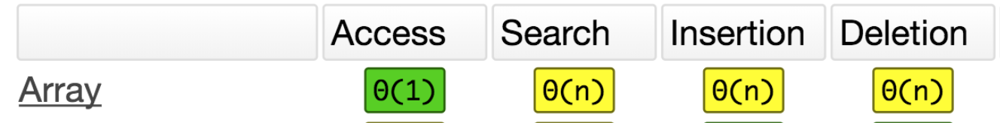
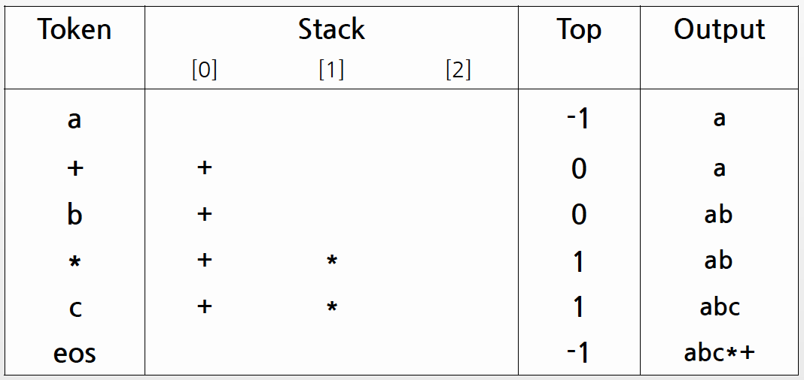

> 정렬할 데이터가 특수한 형태가 아니라면 standard 정렬 알고리즘을 쓰는것이 가장 좋지만, 정렬알고리즘에도 여러가지가 있고 각각의 정렬방법마다 빅오 노테이션이 다르다.

--------
목차 
1. 자료구조
2. ADT
3. 자료구조의 선택
---

## 1. 자료구조
상황에 알맞은 자료구조를 선택하는 일은 매우 중요합니다.
우리가 필요로 하는 동작들을 가장 빠르게 수행 가능한 자료구조를 선택해야해요.

## 2. ADT (Abstract Data Type)
스택이나 큐같은 동작을 정의한다.

> Cartesian Tree ~ KD Tree : 자가정렬

### 2-1. 스택

- 어떤 특정 배열의 인덱스의 값을 알고 싶을 때 배열을 반환 속도가 빠르다.
- 배열 사이에 인덱스를 추가하고 싶을 경우 해당 인덱스의 뒤의 인덱스들을 하나씩 뒤로 미뤄야하기 때문에 n만큼의 시간복잡도가 나온다.

- 택시에서 자주 볼 수 있는 동전통을 만들 때 (?) -> LIFO 
- 재귀함수의 동작을 만들어 낼 때 
- StackTrace를 만들고 싶을 때 
- prefix, infix, postfix 표현법을 전환할 때 
- 트리를 서치할 때, 깊이 우선 탐색 (depth-first search)를 하려고 한다면.

#### Infix => Postfix
변환할 수식 : a+b*c  => a b c * + 
Infix 수식을 왼쪽부터 오른쪽으로 scan하면서 아래 작업 수행 
  1.  피연산자는 바로 출력 
  2.  연산자는 우선순위가 자신보다 더 높은 연산자가 뒤에 나오지 않을 때 출력  
  3.  연산자 출력 방법으로 스택 사용

### 2-2. 큐
- enqueue
  - FIFO(First In First Out)
  - 맨 앞 인덱스의 값이 빠져나갈 경우, 두번째 인덱스가 밀려오진 않는다.
  - 그 해결방법은 `circular queue`
- dequeue
- 식당에서 냉장고를 관리할 때 (?) - FIFO 
- 요청을 순서대로 처리하고 싶을 때 
- 다량의 메시지(혹은 요청)가 쏟아질 때 이를 효율적으로 처리하기 위해 
- 메신저, 주문처리등에서 매우 많이 사용합니다. (Message Queue) 
- 트리를 서치할 때, 넓이 우선 탐색 (breadth-first search)를 하려고 한다면.

### 2-3. 싱글링크드 리스트
- 중간 노드에 가기 위해서는 처음 head부터 접근하는 방법밖에 없다.
- 효과적으로 할 일 목록을 만들 때(?) 
- 우선순위가 있는 큐를 만들고 싶을 때 
- 얼마나 커질지 모르는 데이터를 다뤄야할 때  
- 배열은 초기에 크기를 설정하고 정의합니다. 
- Low-level optimization이 필요 없는 경우, 배열보다 편리합니다.

### 2-4. 더블링크드 리스트

#### cf. 리스트와 배열
- 리스트와 배열은 거의 비슷해보입니다. 
- 이 둘을 구분하여 써야하는 상황을 생각해봅시다.

1. 선형으로 저장되는 자료구조에서 항상 정렬을 유지해야하며, 삽입과 삭제가 빈번한 경우
  - 값을 중간에 넣을 수 있는 리스트가 좋습니다. 배열은 정렬에 시간이 걸립니다.
2. 선형으로 저장되는 자료구조에서 랜덤 엑세스가 자주 발생할 경우
  - 빠르게 데이터를 읽을 수 있는 배열이 좋습니다.
3. 데이터 삽입시에 우선순위가 있어, 중간에 데이터를 삽입하는 일이 빈번할 때
  - 값을 중간에 넣을 수 있는 리스트가 좋습니다. 배열은 중간에 데이터를 넣으려면 뒤에 있는 데이터를 모두 미뤄줘야합니다.
4. 빠르게 모든 값을 훑어봐야 할 경우
  - 데이터 Iteration이 빠른 배열이 좋습니다.
  - 리스트는 선형 구조가 아니라 분포되어있는 모양이기 때문에 접근자체부터 느리다.

실무에서는 대부분의 상황이 겹쳐 오는 경우가 많습니다. 
각 자료구조의 특성을 알고, 빈번하거나 우선순위가 높은 기능에 따라 자료구조를 선택합시다.

### 2-5. 트리
- 마인드맵을 만들 때 (?) 
- 자동 정렬이 되어 있는 자료구조를 만들고 싶을 때 
- 자가 균형 이진(n진) 탐색 트리라고 합니다. 
- 무손실 데이터 압축 (Huffman code) 
- Heap Sort 등의 일부 소팅 알고리즘

### 2-6. 해시 테이블
- 화장품을 박스에 잘 정리하고 싶을 때(?) 
- 백과 사전을 만들고 싶을 때(?) 
- 정렬, 순회 탐색 등이 필요 없고, 삽입과 삭제 및 값 확인이 필요할 때 
- Dictionary, Object 등의 자료구조를 만들 때 
  - 이 자료구조들은 아이템 순회가 가능합니다. 어떻게 가능할까요?

--------
## 3. 자료구조의 선택
회원의 비밀번호를 저장할 때 중요한 것은 무엇일까요? 
1. 회원의 비밀번호를 정렬할 필요가 있을까요? 
2. 회원의 비밀번호를 새로 생성하는 경우가 빈번할까요? 
3. 회원의 비밀번호를 삭제하는 경우가 빈번할까요? 
4. 회원의 비밀번호에 접근하는 경우가 빈번할까요? 
5. 회원의 비밀번호를 검색하는 경우가 빈번할까요?

회원의 생일를 저장할 때 중요한 것은 무엇일까요? 
1. 회원의 생일을 정렬할 필요가 있을까요? 
2. 회원의 생일을 새로 생성하는 경우가 빈번할까요? 
3. 회원의 생일을 삭제하는 경우가 빈번할까요? 
4. 회원의 생일에 접근하는 경우가 빈번할까요? 
5. 회원의 생을을 검색하는 경우가 빈번할까요?

이렇듯, 상황에 필요한 자료구조는 모두 다릅니다. 
또한, 모든 데이터 구조는 Pros/Cons가 있습니다. 
언어별로 구현에 차이가 있을 수 있으므로 자료구조를 선택할 시에  
스펙과 지원 기능을 한 번씩 읽어보고 사용하는 습관을 기릅시다.

