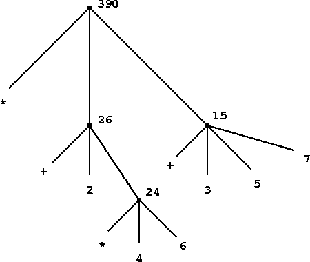
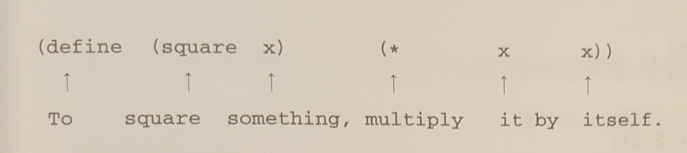
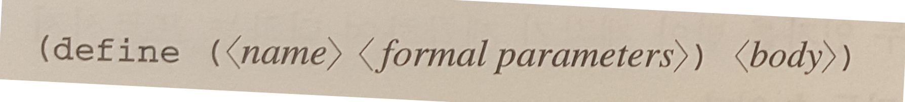
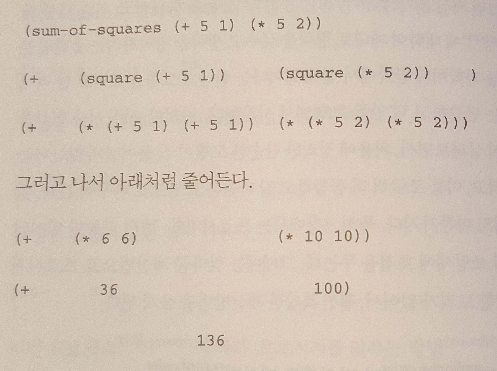
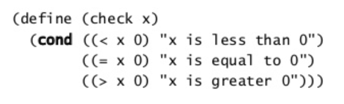

> 컴퓨터 프로그램의 구조와 해석을 읽고 메모한 내용입니다.

--------
목차 
1. 프로그램 짤 때 바탕이 되는 것
- 식
- 이름과 환경
- 엮은식을 계산하는 방법
- 묶음 프로시저
- 맞바꿈 계산법으로 프로시저를 실행하는 방법
- 조건식과 술어
- 연습: 뉴튼 법으로 제곱근 찾기
- 블랙박스처럼 간추린 프로시저

---

## 1. 프로그램 짤 대 바탕이 되는 것
서론
- 초보 프로그래머는 자기가 부린 마법이 어떤 결과를 일으킬지 미리 알아차리는 방법을 배워야 한다.

#### 계산 프로세스란? computational process
- 컴퓨터 속에 있는 것이며, 데이터라고 하는 것을 조작하면서 어떤 일을 한다.
- 프로세스는 사람이 만든 규칙에 따라 움직이고, 이 규칙을 가리켜 프로그램이라 한다.

#### Lisp란?
수학에서 쓰는 논리식 가운데 재귀 방정식을 컴퓨터 계산 모형으로 사용할 수 있는지 엄밀히 살펴보기 위해 1950년대에 존 매카시가 만든 언어다.

#### 프로그래밍 언어는
프로세스에 대한 사람의 생각을 짜임새 있게 담아내는 그릇이기도 하다.
1. 기본식 : 언어에서 가장 단순한 것을 나타낸다.
2. 엮어내는 순단 : 간단한 것을 모아 복잡한 것으로 만든다.
3. 요약하는 수단 : 복잡한 것에 이름을 붙여 하나로 다룰 수 있게끔 간추린다.

---------
### 1-1. 식
#### 앞가지 쓰기 prefix notation
연산자를 피연산자 왼쪽에 두는 방식
```js
(* 5 99)
// *은 연산자 , 5 99는 피연산자
```

#### 가지런히 쓰기 pretty-printing
식을 깊이 겹쳐 써야 할 때 인자를 중심으로 줄을 맞추고 알맞게 들여쓰는 방식
```js
(+ (* 3
      (+ (* 2 4)
         (+ 3 5)))
   (+ (- 10 7)
      6))
```
---------
### 1-2. 이름과 환경
프로그래밍 언어에서 아주 중요한 기능 가운데 하나는 계산 물체(computational object)에 이름을 붙이는 수단이다.
이름은 변수가 되고, 그 변수의 값은 계산 물체가 된다.
Scheme에서는 이름을 지을 때 `define`을 쓴다.
```js
(define size 2)
```
어떤 값에 이름(기호, symbol)을 붙여 두었다가 뒤에 그 이름으로 필요한 값을 찾아 쓸 수 있다는 말은, 실행기 속 어딘가에 이름-물체의 쌍을 저장해 둔 메모리가 있다는 뜻이다. 이런 기억 공간을 `환경`이라고 한다.
---------
### 1-3. 엮은식을 계산하는 방법

- 마디 node : 나무 그림 속에서 연산자 
- 가지 branch : 연산할 것들
- 끝마디 terminal node : 연산자나 수
- 나무꼴 어큐뮬레이션 tree accumulation : 값을 위로 올려 보내는 규칙

1. 엮은 식에서 부분식의 값을 모두 구한다.
2. 엮은식에서 맨 왼쪽에 있는 식(연산자)의 값은 프로시저가 되고, 나머지 식(피연산자)의 값은 인자가 된다. 프로시저를 인자에 적용하여 엮은 식의 값을 구한다.

#### 기본 식을 다루는 규칙
- 숫자 식의 값은 여러 숫자가 모여서 나타내는 값이다.
- 붙박이 연산자 built-in perator의 값은 그 연산자가 뜻하는 연산을 하도록 `미리 묶어 놓은 기계 명령들`이다.
- 그 밖에 다른 이름 값은 환경에서 그 이름으로 정의해 둔 물체다.

#### 특별한 형태 special form
보통 계산 규칙으로는 값을 구하지 못하기 때문에 계산 규칙이 따로 밝혀져 있어야 하는 문법

> 여러 종류의 식이(그리고 식의 종류마다 다른 값을 구하는 규칙이) 모여서 프로그래밍 언어의 문법을 이루게 된다.

---------
### 1-4. 묶음 프로시저
좋은 프로그래밍 언어가 꼭 갖춰어야 할 것

- 수와 산술 연산이 기본 데이터고 기본 프로시저다.
- 엮은식을 겹쳐 쓰는 것이 여러 연산을 한데 묶는 수단이 된다.
- 이름과 값을 짝 지워 정의한 것이 모자라나마 요약하는 수단이 된다.
> 프로시저를 어떻게 정의해야할까!

#### 프로시저 정의
복잡한 연산에 이름을 붙여서 쓰는 방법으로, 큰 프로그램을 짤 적에 아주 쓸모가 많다.




---------
### 1-5. 맞바꿈 계산법으로 프로시저를 실행하는 방법
맞바꿈 계산법이란
- 프로세스에 따라, 프로시저를 맞추는 방법
- 자바스크립트에서 함수내부에 함수가 있어서 인자가 계속 전달되는 상황과 같다.

### 인자 먼저 계산법과 정의대로 계산법
정의대로 계산법 normal-order evaluation
- 끝까지 펼친 다음에 줄이는 계산방법



인자 먼저 계산법 applicative-order-evaluation
- 인자 값부터 먼저 구하는 방법
- Lisp는 인자 먼저 계산하는 규칙으 따른다.
  - 빠르고 가볍게 계산할 수 있고
  - 맞바꿈 계산법이 통하지 않는 프로시저가 있을 때에는 정의대로 계산하는 규칙이 더 복잡하기 때문.

---------
### 1-6. 조건 식과 술어  predicate
#### 갈래나누기
- Lisp에서는 `cond`라는 문법이 있다.



#### 술어 predicate
- 첫 식을 술어(predicate)라고 한다. 
- 조건식이라고 생각하면 된다. (if 절)
- 참이나 거짓이라고 대답하는 프로시저 또는 식을 가리킬 때 널리 쓰는 말.
- `>`,`<`,`=`

#### if


<predicate>를 먼저 계산 
- 참이면 <consequent>
- 거짓이면 <alternative>


#### and
#### or
#### not


---------
### 1-7. 연습: 뉴튼법으로 제곱근 찾기
앞서 나온 프로시저들은 여러 매개분수에 따라 달라지는 값을 정의한다는 점에서 수학에서 말하는 함수와 매우 비슷하다. 하지만 수학 함수와 컴퓨터 프로시저 사이에는 아주 큰 차이점이 있다.
- 무엇이 어떤 성질을 지니는지 밝히는 일과, 그 무엇을 어떻게 만들지 또는 구할지 나타내는 일의 차이점과 같다.
- 지식과 푸는 방법에 대한 지식.

> 이 부분 아직 잘 모르겠다.

---------
### 1-8. 블랙박스처럼 간추린 프로시저
블랙박스 black box
- 특정 프로시저가 어떻게 값을 구하는지는 몰라도 어떤 값을 내놓는다는 것은 알 수 있다..

#### 프로시저 요약하기 procedural abstraction
#### 갇힌이름 local name
프로시저 정의에서 쓰는 매개변수 이름은 프로시저에 갇힌 local, 곧 몸 속에서만 쓰는 이름이어야 한다.

1. 매인변수 `bound variable`
프로시저에 인자 이름이 매인다`bind`는 뜻에서 이런 변수를 매인변수라 한다.

2. 자유변수 `free variable`
프로시저 정의에 매이지 않은 변수
- 자바스크립트의 클로저에서 어떤 변수에 엮여있는 함수가 클로져인데, 여기서 어떤 변수를 자유변수라고 한다. 

3. 유효범위 `scope`
매인이름을 쓸 수 있는 식을 일컬어 그 이름의 유효범위라고 한다. 즉 프로시저 정의에서는 그 프로시저의 몸이 인자 이름을 볼 수 있는 넒이.

#### 안쪽정의 `internal definition`와 블록구조 `block structure`

