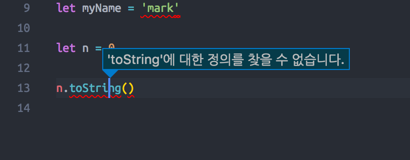

20171108 [강의노트](http://slides.com/woongjae/deck-8#)
---------
2017/05 기초 세미나

# 1. TypeScript Overview
TypeScripts는 그냥 언어이다. 이 언어는 자바스크립트와 호환된다. SuperSet이라고해서, 자바스크립트의 feature를 사용하고 그 위에 타입스크립트의 문법을 포함시킨 언어라고 보면된다.

- 타입스크립트는 `프로그래밍 언어` 입니다.
- 타입스크립트는 `Compiled Language` 이다.
  - 자바스크립트는 인터프리터 언어이다.
    - 컴파일러: 한 번 컴파일 하게 되면, 별도 생성된 목적 파일을 통해 빠르게 실행할 수 있다. 대용량 소스에 적합
    - 인터프리터: 목적 파일 산출 과정이 없이 실행과 동시에 줄 단위로 번역이 된다. 저용량 소스에 적합 (출처: http://blog.sejongin.kr/44 [IT일상])
  - 전통적인 컴파일 언어와는 다른 점이 많다.
  - 그래서 Transpile이라는 용어를 사용하기도 한다. (전통적인 컴파일러는 아니기때문)
  - `메타 프로그래밍`이라고도 한다.
- 자바스크립트는 `Interpreted Language`입니다.


## Compiled 
- 컴파일이 필요 O
- 컴파일러가 필요 O
- 컴파일하는 시점 O
  - => 컴파일 타임
- 컴파일된 결과물을 실행
- 컴파일된 결과물을 실행하는 시점

## Interpreted
- 컴파일이 필요 X 
- 컴파일러가 필요 X
- 컴파일하는 시점 X
- 코드 자체를 실행
- 코드를 실행하는 시점 o
  - = 런타임

## 정적 타입 언어 vs 동적 타입 언어
- 정적 타입 언어 : 미리 타입을 지정해놓고 시작
- 동적 타입 언어 : 타입을 정하지 않는다. 타입 자체가 변화하는 것을 막지않는다.
> 정적타입언어만 갖고오자라고 한 것이 TypeScript
> 동적 타입 언어가 갖고 있는 단점을 커버하자.하는 목적이다.
>> test coverage를 올리면 상관없긴하다.

## Tranditional Compiled Language
- 컴파일 언어라고 한다.
- C, C++, Go, C#, Java, ...
- 프로그래머가 작성한 `Source Code` 를 기계어로 변환하는 과정을 `Compile` - 이라고 한다.
- 기계어로 변환된 결과물을 `Object Code` (목적 코드)라 한다.
- `Compile` 하는 프로그램을 `Compiler` 라고 한다.
- `Compile` 하는 동안을 `Compile Time` 이라고 한다.
- 컴파일된 코드는 프로세서에 따라 다르다.
- 소스 코드에서는 OS 에 따라 라이브러리가 다르다.
- 컴파일된 코드는 작은 크기에 최적화된다.
- 일반적으로 실행시 기계어로 바꾸는 방식(인터프리터 언어)보다 빠르다.
- 실행시 기계어로 바꿔주는 연산이 필요없기 때문이다.

### 타입스크립트에 대한 문법을 알아야 하고, 타입스크립트가 자바스크립트로 변환되는 과정에서 컴파일러의 옵션을 통해서 어떻게 제어할 수 있는지, 타입스크립트를 제어하는 기구들이 뭐가 있는지 아는 것이 수업의 목표.

----

# 2. 개발 환경 구축 및 컴파일러 사용
셋팅 방법
```bash
npm init -y
npm i typescript // 프로젝트 이름(폴더이름)이 동일하면 안된다.
package.json > "scripts"에 "transpile" : "tsc" 추가.
// tsc파일이 .bin폴더 내부에 있는데, npm에서는 .bin내부의 파일들은 전체 상대 경로를 적지 않아도 접근 가능하다.
npm run transpile
```
- typescirpt를 글로벌로 설치할 경우 `tsc 파일이름.ts` 명령어만으로 컴파일이 가능하다.
- 로컬로만 설치할 경우, 위의 방법처럼 따로 스크립트에 추가 후에 명령어를 사용하면된다.

> cli 명령어로 명렁어를 다 걸어둘 수 있지만 json파일을 마들어서 설정을 정리하며서 쓴다.

-----
# 3. Compiler Options
최상위 프로퍼티
> tsconfig.json 파일에서 사용하는 컴파일 옵션들
- compileOnSave
- extends
- compileOptions (초기에는 compileOptions 요소가 많이 존재한다.)
- files
- include
- exclude


## 1. compileOnSave
파일 변경 후 저장하면 바로 컴파일을 해준다. 에디터마다 안될 수도 있다.
- true / false (default false)
- 최상단에 설정해야 한다 ?
- 누가 ??
  - Visual Studio 2015 with TypeScript 1.8.4 이상
  - atom-typescript 플러그인

## 2. extends
- 파일 (상대) 경로명: string
- TypeScript 2.1 New Spec

```json
 // in config/base.json
{
  "compilerOptions": {
    "noImplicitAny": true,
    "strictNullChecks": true
  }
}


// in tsconfig.json
{
  "extends": "./configs/base",
  "files": [
    "main.ts",
    "supplemental.ts"
  ]
}
// 클라이언트 레벨의 타입스크립트 덩어리가 있고, 서버사이드 타입스크립트 덩어리가 있을 때 설정이 비슷하다면, 상속 받은 후 부분적으로 변경 후 사용할때 주로 사용한다.
```

## 3. files, include, exclude
- 셋다 설정이 없으면, 전부다 컴파일

- files
  - 상대 혹은 절대 경로의 리스트 배열입니다.
  - 파일별 부분 컴파일이 된다.
  - exclude 보다 쎕니다.
  - 특정 폴더를 exclude가 있어도 컴파일 된다.

- include, exclude
  - glob 패턴 (마치 .gitignore)
  
  - include
    - exclude 보다 약합니다.
    - * 같은걸 사용하면, .ts / .tsx / .d.ts 만 include (allowJS)
  
  - exclude
    - 설정 안하면 4가지(node_modules, bower_components, - jspm_packages, <outDir>)를 default 로 제외합니다. - (아하!)
    - <outDir> 은 `항상 제외합니다.` (include 에 있어도)


## @types
TypeScript 2.0 부터 사용 가능해진 `내장 type definition 시스템`
- 아무 설정을 안하면 ?
  - node_modules/@types 라는 모든 경로를 찾아서 사용
- typeRoots 를 사용하면 ?
  - 배열 안에 들어있는 경로들 아래서만 가져옵니다.
- types 를 사용하면 ?
  - 패키지 이름입니다.
  - 배열 안의 모듈 혹은 ./node_modules/@types/ 안의 모듈 이름에서 찾아옵니다.
  - [] 빈 배열을 넣는다는건 이 시스템을 이용하지 않겠다는 것입니다.
- typeRoots 와 types 를 같이 사용하지 않습니다.
```json
// compiileOptions : type
{
    "type": "object",
    "description": "Instructs the TypeScript compiler how to compile .ts files.",
    "properties": {
        "typeRoots": {
            "description": "Specify list of directories for type definition files to be included. Requires TypeScript version 2.0 or later.",
            "type": "array",
            "items": {
                "type": "string"
            }
        },
        "types": {
            "description": "Type declaration files to be included in compilation. Requires TypeScript version 2.0 or later.",
            "type": "array",
            "items": {
                "type": "string"
            }
        }
    }
}
```

## compileOptions: target과 lib
```json
{
    "type": "object",
    "description": "Instructs the TypeScript compiler how to compile .ts files.",
    "properties": {
        "target": {
            "description": "Specify ECMAScript target version. Permitted values are 'es3', 'es5', 'es2015', 'es2016', 'es2017' or 'esnext'.",
            "type": "string",
            "default": "es3",
            "anyOf": [
                {
                    "enum": [
                        "es3",
                        "es5",
                        "es2015",
                        "es2016",
                        "es2017",
                        "esnext"
                      ]
                }, {
                      "pattern": "^([eE][sS]([356]|(201[567])|[nN][eE][xX][tT]))$"
                }
            ]
        },
        "lib": {
            "description": "Specify library file to be included in the compilation. Requires TypeScript version 2.0 or later.",
            "type": "array",
            "items": {
                "type": "string",
                "enum": [ "es5", "es6", "es2015", "es7", "es2016", "es2017", "esnext", "dom", "dom.iterable", "webworker", "scripthost", "es2015.core", "es2015.collection", "es2015.generator", "es2015.iterable", "es2015.promise", "es2015.proxy", "es2015.reflect", "es2015.symbol", "es2015.symbol.wellknown", "es2016.array.include", "es2017.object", "es2017.sharedmemory", "esnext.asynciterable"
                ]
            }
        },
        "noLib": {
            "description": "Do not include the default library file (lib.d.ts).",
            "type": "boolean"
        }
    }
}
```

target
- 빌드의 결과물을 어떤 버전으로 할 것이냐
- 지정을 안하면 `es3` 입니다.

lib
- 기본 type definition 라이브러리를 어떤 것을 사용할 것이냐
- 잘 정의하지 않으면 빨간줄이 계속 생긴다.
- lib 를 지정하지 않을 때,
  - target 이 'es3' 이고, 디폴트로 lib.d.ts 를 사용합니다.
  - target 이 'es5' 이면, 디폴트로 dom, es5, scripthost 를 사용합니다.
  - target 이 'es6' 이면, 디폴트로 dom, es6, dom.iterable, scripthost 를 사용합니다.
  - es5 이후에는 문법별 쪼개서도 설정 가능하다. 
- ​lib 를 지정하면 그 lib 배열로만 라이브러리를 사용하니다.
  - ​빈 [] => 'no definition found 어쩌구'
  - 혹은 `"noLib" : true`로 바꾸면 된다. (거의 안쓸듯)
  

## compileOptions: outDir, outFile
- 파일을 다 모아서 하나의 컴파일된 하나의 파일로 모으고 싶을 때 outFile을 사용
- 소스디렉토리에 그대로 똑같이 구조를 컴파일된 상태로 옮길 때 outDir를 사용
- 많이 사용한다.
```json
{
    "type": "object",
    "description": "Instructs the TypeScript compiler how to compile .ts files.",
    "properties": {
        "outFile": {
            "description": "Concatenate and emit output to single file.",
            "type": "string"
        },
        "outDir": {
            "description": "Redirect output structure to the directory.",
            "type": "string"
        },
        "rootDir": {
            "description": "Specifies the root directory of input files. Use to control the output directory structure with --outDir.",
            "type": "string"
        }
    }
}
```

## compileOptions: module
- 결과물을 어떻게 무엇을 쓸것인가에 대한 것이다.
- 컴파일 된 모듈의 결과물을 어떤 모듈 시스템으로 할지를 결정
- target 이 'es6' 이면 es6 가 디폴트이고,
- target 이 'es6' 가 아니면 `commonjs` 가 디폴트 입니다.
- AMD 나 System 와 사용하려면, `outFile 이 지정되어야 합니다.`
- ES6 나 ES2015 를 사용하려면, target 이 es5 이하여야 합니다.

moduleResolution
- ts 소스에서 모듈을 사용하는 방식을 지정해야 합니다.
- Classic 아니면 Node 입니다.
- CommonJS 일때만 Node 라고 생각하시면 됩니다.

path**s** 와 baseUrl
- 상대경로 방식이 아닌 baseUrl 로 꼭지점과 paths 안의 키/밸류로 모듈을 가져가는  방식입니다.

rootDirs : 배열 안에서 상대 경로를 찾는 방식입니다.

```json
{
    "type": "object",
    "description": "Instructs the TypeScript compiler how to compile .ts files.",
    "properties": {
        "module": {
            "description": "Specify module code generation: 'none', 'CommonJS', 'Amd', 'System', 'UMD', or 'es2015'.",
            "enum": [ "commonjs", "amd", "umd", "system", "es6", "es2015", "none" ]
        },
        "moduleResolution": {
            "description": "Specifies module resolution strategy: 'node' (Node) or 'classic' (TypeScript pre 1.6) .",
            "type": "string",
            "pattern": "^(([Nn]ode)|([Cc]lassic))$",
            "default": "classic"
        },
        "baseUrl": {
            "description": "Base directory to resolve non-relative module names.",
            "type": "string"
        },
        "paths": {
            "description": "Specify path mapping to be computed relative to baseUrl option.",
            "type": "object"
        },
        "rootDirs": {
            "description": "Specify list of root directories to be used when resolving modules.",
            "type": "array",
            "items": {
                "type": "string"
            }
        }
    }
}
```

---
# 4. TypeScript Basic Types 
- TypeScript 에서 프로그램 작성을 위해 기본 제공하는 데이터 타입
- **사용자가 만든 타입은 결국은 이 기본 자료형들로 쪼개집니다.**
- JavaScript 기본 자료형을 포함 (superset)
  - ECMAScript 표준에 따른 기본 자료형은 6가지
    - Boolean
    - Number
    - String
    - Null
    - Undefined
    - Symbol (ECMAScript 6 에 추가)
    - Array : object 형
- 프로그래밍을 도울 몇가지 타입이 더 제공된다.
  - 함수의 리턴값에서 많이 쓰인다.
  - Any
  - Void
  - Never
  - Enum
  - Tuple : object 형
    - 잘 사용하지 않는다.

## Primitive Type
- 오브젝트와 레퍼런스 형태가 아닌 실제 값을 저장하는 자료형입니다.
- 프리미티브 형의 내장 함수를 사용 가능한것은 자바스크립트 처리 방식 덕분

```js
let name = 'mark';

name.toString();
```

## literal ?
- 값 자체가 변하지 않는 값을 의미합니다.
- 상수와 다른 것은 상수는 가리키는 포인터가 고정이라는 것이고, 리터럴은 그 자체가 **값이자 그릇**입니다.
```js
35; // number 리터럴
'mark' // string 리터럴
true // boolean 리터럴

// object 리터럴
{
    name: 'mark',
    age: 35
}
```
- "리터럴  상수는 5, 1.23   과  같은  숫자나, 과 같은 문자열 등을 말합니다. 'This  is  a  string'   혹은 "It’s  a  string!"이것들이  리터럴  상수라고  불리우는  이유는  이것들이  프로그램  내에  직접  문자  형태로(literally)지정되는  값들이기  때문입니다.  이러한  값들은  한번  지정되면  변하지  않습니다.  예를  들면  숫자2   는  언제나  자기  자신이  2라는  숫자임을  나타내며  어떤  다른  의미도  갖지  않습니다.  이들은  한번  지정되면  그  값을  변경할  수  없기  때문에  _상수_입니다.  그  중에서도  특별히  이러한  값들을  리터럴 상수라고 부릅니다." @kangpual
  
## Boolean / boolean
- 가장 기본적인 데이터 타입
- 단순한 true 혹은 false 값 입니다.
- JavaScript / TypeScript 에서 **'boolean'** 이라고 부른다.

```js
let isDone: boolean = false;

typeof isDone === 'boolean' // true

// Type 'boolean' is assignable to type 'Boolean'.
let isOk: Boolean = true;

// Type 'Boolean' is not assignable to type 'boolean'.
// 'boolean' is a primitive, but 'Boolean' is a wrapper object.
// Prefer using 'boolean' when possible.
let isNotOk: boolean = new Boolean(true);
```

## Number / number
- JavaScript 와 같이, TypeScript 의 모든 숫자는 부동 소수점 값 입니다.
- TypeScript는 16진수 및 10진수 리터럴 외에도, ECMAScript 2015에 도입된 2진수 및 8진수를 지원합니다.

```js
let decimal: number = 6; // 10진수 리터럴

let hex: number = 0xf00d; // 16진수 리터럴

let binary: number = 0b1010; // 2진수 리터럴

let octal: number = 0o744; // 8진수 리터럴
```

## String / string
- 다른 언어에서와 마찬가지로 텍스트 형식을 참조하기 위해 `string`형식을 사용한다.
- 자바스크립트와 마찬가지로, 타입스크립트는 문자열 데이터를 둘러싸기 위해 큰 따옴표나 작은따옴표를 사용한다.
```js
let name: string = "mark";

name = 'anna';
```

## Template String
- 주로 사용한다.
- 행에 걸쳐 있거나, 표현식을 넣을 수 있는 문자열
- 이 문자열은 backtick (= backquote) 기호에 둘러쌓여 있습니다.
- 포함된 표현식은 `${ expr }` 와 같은 형태로 사용합니다.

```js
let fullName: string = `Bob Bobbington`;
let age: number = 37;

let sentence: string = `Hello, my name is ${ fullName }.

I'll be ${ age + 1 } years old next month.`;

// template string 을 사용하지 않을 경우
let sentence: string = "Hello, my name is " + fullName + ".\n\n" +
    "I'll be " + (age + 1) + " years old next month.";
```

## Undefined & Null
- TypeScript 에서 'undefined' 와 'null' 은 실제로 각각 'undefined' 와 'null' 이라는 고유한 타입을가집니다.
- 'void' 와 마찬가지로, undefined 와 null 은 그 자체로는 쓸모가 없습니다.
- 둘다 소문자만 존재합니다.

```js
// 이 변수들에 할당할 수 있는 것들은 거의 없다.

let u: undefined = undefined;
let n: null = null;
```

### undefined & null are subtypes of all other types. (모든 타입의 서브타입이다.)
- 기본 설정이 그렇습니다.
- number 에 null 또는 undefined 를 `할당할 수 있다는 의미`입니다.
- 하지만, 컴파일 옵션에서 `--strictNullChecks`사용하면, null 과 undefined 는 void 나 자기 자신들에게만 할당할 수 있습니다.
- 이 경우, null 과 undefined 를 할당할 수 있게 하려면, union type 을 이용해야 합니다. (union type: 두개의 타입을 합치는 것.)

```js
let name: string = null;
let age: number = undefined;

// strictNullChecks => true
// Type 'null' is not assignable to type 'string'.
let name: string = null; (X)

// null => null || void, undefined => undefined || void
// Type 'null' is not assignable to type 'undefined'.
let u: undefined = null; // (X)

let v: void = undefined; // (O)

let union: string | null | undefined = 'str';
```

### null in JavaScript 
- null 이라는 값으로 할당된 것을 null 이라고 합니다.
- 무언가가 있는데, 사용할 준비가 덜 된 상태.
- null 이라는 타입은 null 이라는 값만 가질 수 있습니다.
- 런타임에서 typeof 연산자를 이용해서 알아내면, object 입니다.

```js
let n: null = null;

console.log(n); // null
console.log(typeof n); // object
```

### undefined in JavaScript 
- 값을 할당하지 않은 변수는 undefined 라는 값을 가집니다.
- 무언가가 아예 준비가 안된 상태
- object 의 property 가 없을 때도 undefined 입니다.
- 런타임에서 typeof 연산자를 이용해서 알아내면, undefined 입니다.
```js
let u: undefined = undefined;

console.log(u); // undefined
console.log(typeof u); // undefined
```

## Void
- 타입이 없는 상태입니다.
- `any` 와 반대의 의미를 가집니다.
- Void 는 없습니다. 소문자입니다.
- 주로 함수의 리턴이 없을 때 사용합니다. 그 외에는 사용할 일이 거의 없습니다.

```js
function returnVoid(message): void {
    console.log(message);
}

returnVoid('리턴이 없다');
```

## Any
- 어떤 타입이어도 상관없는 타입입니다.
- 이걸 최대한 쓰지 않는게 핵심입니다.
- 왜냐면 컴파일 타임에 타입 체크가 정상적으로 이뤄지지 않기 때문입니다. 
- 그래서 컴파일 옵션 중에는 any 를 쓰면 오류를 뱉도록 하는 옵션도 있습니다.
    - noImplicitAny

```js
function returnAny(message): any {
    console.log(message);
}

returnVoid('리턴은 아무거나');
```

## Never
- 리턴에 주로 사용된다.
- 아래의 3가지 정도가 대부분
```js
// Function returning never must have unreachable end point
function error(message: string): never {
    throw new Error(message);
}

// Inferred return type is never
function fail() {
    return error("Something failed");
}

// Function returning never must have unreachable end point
function infiniteLoop(): never {
    while (true) {
    }
}
```

## Array
- 원래 자바스크립트에서 array 는 객체입니다.
- 사용방법
    - Array<타입>
    - 타입[]

```js
let list: number[] = [1, 2, 3];

let list: Array<number> = [1, 2, 3];
```

## Tuple
- **배열인데 타입이 한가지가 아닌 경우**
- 마찬가지로 **객체**입니다.
- 꺼내 사용할때 주의가 필요합니다.
    - 배열을 Destructuting 하면 타입이 제대로 얻어집니다.

```js
// Declare a tuple type
let x: [string, number];
// Initialize it
x = ["hello", 10]; // OK
// Initialize it incorrectly
x = [10, "hello"]; // Error

x[3] = "world"; // OK, 'string' can be assigned to 'string | number'

console.log(x[5].toString()); // OK, 'string' and 'number' both have 'toString'

x[6] = true; // Error, 'boolean' isn't 'string | number'

const person: [string, number] = ['mark', 35];

const [name, age] = person;
```

## Enum
- C 에서 보던것과 같습니다.
- 아래 예제만 이해하면 사용 준비 끝

```js
enum Color {Red, Green, Blue}
let c: Color = Color.Green;

enum Color {Red = 1, Green, Blue}
let c: Color = Color.Green;

enum Color {Red = 1, Green = 2, Blue = 4}
let c: Color = Color.Green;

enum Color {Red = 1, Green, Blue}
let colorName: string = Color[2]; // 결과값은 string으로 해야한다.
```

## Symbol
- ECMAScript 2015 의 Symbol입니다.
- `프리미티브 타입`의 값을 담아서 사용합니다.
- 고유하고 수정불가능한 값으로 만들어줍니다.
- 그래서 주로 접근을 제어하는데 쓰는 경우가 많았습니다.

```js
let sym = Symbol();

let obj = {
    [sym]: "value"
};

console.log(obj[sym]); // "value"
```